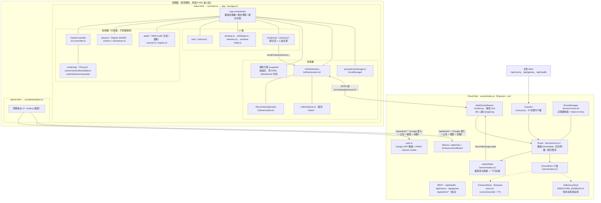
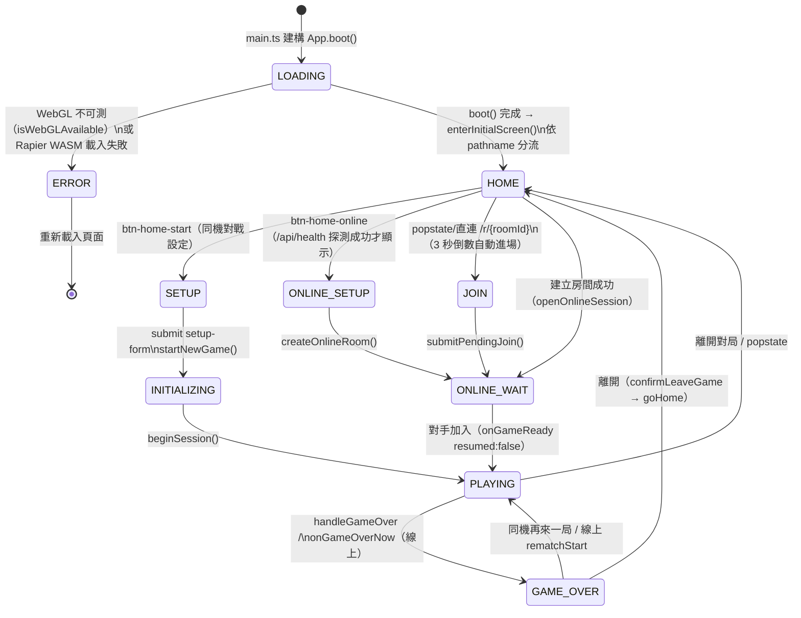
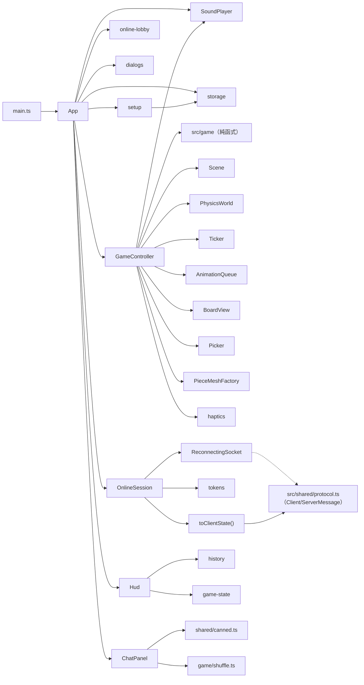
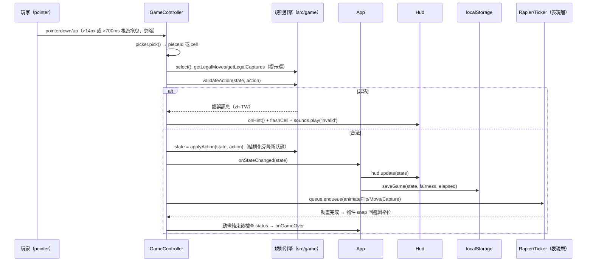
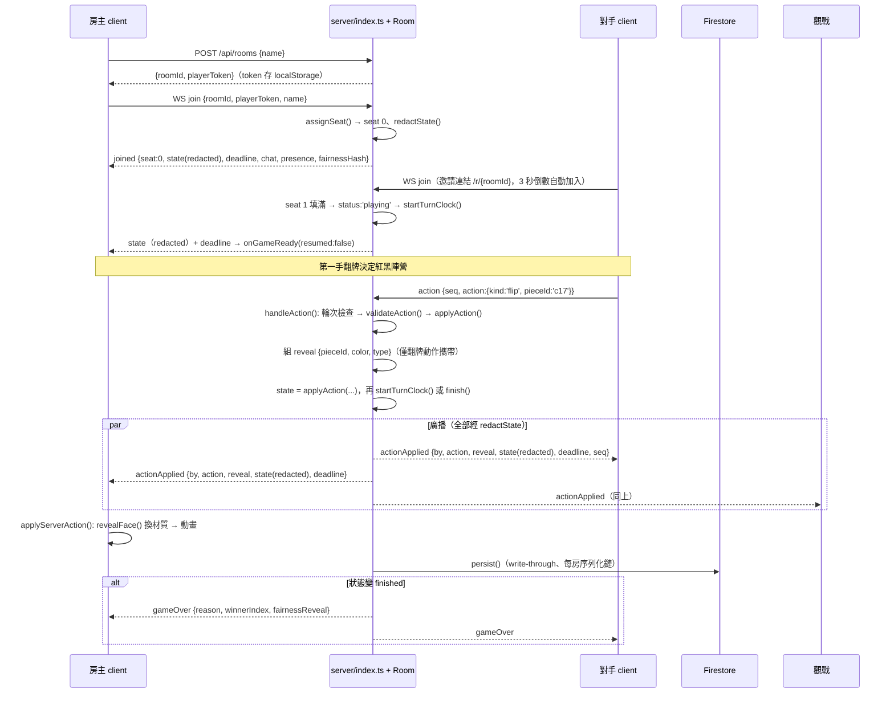
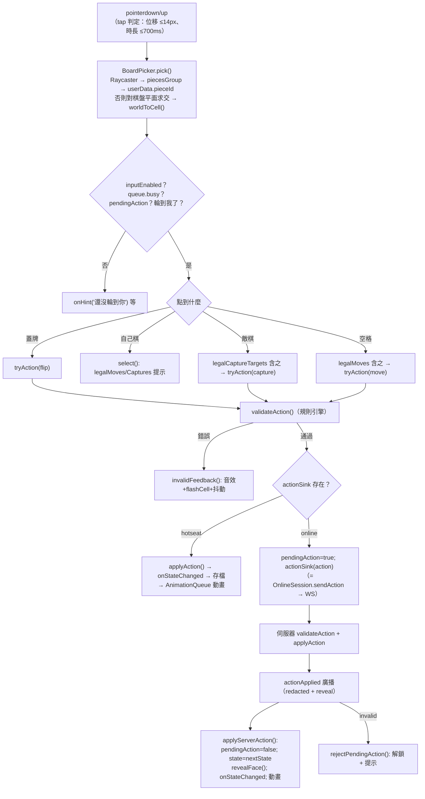

# 02 · 系統架構設計（Architecture）

> 台灣暗棋（Taiwan Dark Chess）3D 網頁遊戲 — 軟體開發規格書
> 文件版本：v1.0（對應產品版號 v1.1.33）· 最後更新：2026-08-29
> 本章所有描述均以實際原始碼為準，引用之檔案路徑與函式名稱皆可在 repository 中查證。

---

## 1. 架構總覽

### 1.1 系統組成

系統由三個可獨立部署/獨立測試的部分組成：

1. **前端 SPA**（`index.html` + `src/`）：單一 Vite bundle，同時承載單機對戰（Hotseat，可部署至 GitHub Pages 純靜態站）與線上對戰（連上 Cloud Run 主站才啟用線上功能）。
2. **管理後台**（`admin.html` + `src/admin/admin.ts`）：第二個 Vite 進入點，獨立 bundle，只存在於 Cloud Run 部署（GitHub Pages 的 `dist/admin.html` 無後端 API 可用）。
3. **遊戲伺服器**（`server/index.ts`，建置為 `dist-server/index.mjs`）：Express（HTTP/靜態/後台 API）+ `ws`（WebSocket 對戰協定）+ Firestore（持久化），部署於 Cloud Run。

### 1.2 系統總覽圖



### 1.3 分層原則

| 層 | 內容 | 依賴方向 | 鐵律 |
| --- | --- | --- | --- |
| 規則層 | `src/game/`（types/rules/actions/game-state/shuffle/fairness/pieces/constants） | 只依賴 Web Crypto 與純 TS | **零 DOM、零 Three.js、零 Rapier**；client 與 server 共用同一份程式碼（`server/tsconfig.json` 明確 include `../src/game/**`） |
| 表現層 | `src/rendering/`、`src/physics/`、`src/audio/` | 依賴規則層型別 | 物理只是表現：`src/physics/world.ts` 註解明言「Physics can never change the game state; pieces always snap back to their logical grid pose」 |
| 編排層 | `src/controller.ts`、`src/app.ts` | 依賴規則層 + 表現層 + UI | 唯一允許把規則引擎、3D、物理、輸入接在一起的地方 |
| UI 層 | `src/ui/` | 只讀 `GameState`/protocol 型別 | 所有文字輸出走 `textContent`/`createTextNode`，絕不 `innerHTML`（`src/ui/chat.ts` 類別註解） |
| 通訊層 | `src/online/`、`src/shared/protocol.ts` | 依賴規則層型別 | 協定訊息一律先經 `server/redact.ts` 才能離開伺服器 |
| 伺服器層 | `server/` | 依賴規則層 + 協定型別 | server-authoritative；動作先驗證後套用；計時以 deadline 惰性判定 |

---

## 2. 單頁應用的畫面狀態機

### 2.1 AppPhase（`src/app.ts` 頂部定義）

```ts
type AppPhase = 'LOADING' | 'HOME' | 'SETUP' | 'INITIALIZING' | 'PLAYING' | 'GAME_OVER'
type GameMode = 'hotseat' | 'online'
```

`GameMode` 不屬於 phase，而是與 phase 正交的旗標（由 `App.setMode()` 管理，會同步切換 `body` 的 `mode-online` class，讓 CSS 以 `.online-only`/`.hotseat-only` 控制按鈕顯示，見 `index.html` 的 `btn-side-restart` 等）。

### 2.2 畫面（ScreenId，`src/ui/setup.ts`）

```ts
const SCREEN_IDS = [
  'screen-loading', 'screen-error', 'screen-home', 'screen-setup',
  'screen-online-setup', 'screen-online-join', 'screen-online-wait', 'screen-game',
] as const
```

`showScreen(id)` 一次只顯示一個 `<section class="screen">`，並呼叫 `screenHistorySync`（由 `App.wireGameUi()` 內的 `setScreenHistorySync` 注入）把網址列同步到 `/`、`/setup`、`/online` 或 `/r/{roomId}`。

### 2.3 狀態機圖



補充細節（皆可在 `src/app.ts` 找到對應程式）：

- **INITIALIZING**：`startNewGame()` 先把 phase 設為 `INITIALIZING`，完成洗牌（`fisherYatesShuffle(createAllPieces())`）、公平性承諾（`createCommitment`）、`createGame()` 後呼叫 `beginSession()` 才進入 `PLAYING`。
- **線上等待**：`screen-online-wait` 不是一個 AppPhase，而是 `ONLINE_WAIT` 語意的畫面（phase 仍為 `HOME`）；`OnlineSession` 的 `onWaiting`/`onGameReady` 回呼推動畫面切換。
- **GAME_OVER 與對局畫面**：線上模式下 `screen-game` 在 `GAME_OVER` 仍然顯示（聊天室可續聊、可等再來一局），只覆蓋 `dialog-gameover` 結算視窗。
- **`boot(options.joinRoomId)`**：`src/main.ts` 以正規式 `/^\/r\/([a-z2-9]{10})$/` 解析邀請網址，命中則跳過首頁直接 `joinOnlineRoom()`。

### 2.4 對局模式（GameMode）

| | hotseat（同機） | online（線上） |
| --- | --- | --- |
| 權威狀態 | 瀏覽器內的 `GameController.state` | 伺服器 `Room.state`；client 只持 redacted 鏡像 |
| 動作流程 | `validateAction` → `applyAction` 立即套用 | `validateAction`（本地預檢）→ `actionSink` 送 WS → 伺服器 `actionApplied` 回播 |
| 座位控制 | `controller.localPlayerIndex = null`（兩方皆可操作） | `controller.localPlayerIndex = seat`；觀戰者 `inputEnabled = false` |
| 存檔 | `saveGame()` 寫 localStorage（`persist()`、`handleStateChanged`） | 不存檔；座位憑證 `playerToken` 存 localStorage（`online/tokens.ts`） |
| 計時 | 累計時鐘 `elapsedBaseMs + playingSince`（`currentElapsedMs()`） | 回合倒數：`TurnDeadline{ at, serverNow }` + `clockOffset` 時鐘校正 |
| 結束 | `clearSavedGame()` + `showGameOverDialog` | `gameOver` 訊息 + fairnessReveal 揭曉 + `showOnlineGameOver` |

---

## 3. 模組邊界與職責

### 3.1 模組清單

| 模組 | 檔案 | 行數 | 職責 | 對外介面（節選） |
| --- | --- | --- | --- | --- |
| **App（orchestrator）** | `src/app.ts` | 1426 | 畫面狀態機、模式切換、瀏覽器歷史導覽、線上 session 裝配、公告已讀、戰情中心渲染、全螢幕、可見度處理 | `boot()`、`loop()`（rAF） |
| **GameController** | `src/controller.ts` | 548 | 規則 ↔ 3D ↔ 物理 ↔ 輸入的橋接；點選拾取、選子提示、動作預檢、動畫排程、伺服器動作回播 | `startSession()`、`frame(dt)`、`tryAction()`、`applyServerAction()`、`rejectPendingAction()` |
| **Rule Engine** | `src/game/` | 652 | 純函式規則引擎：驗證/套用動作、走法與吃子規則、建立棋局、洗牌、公平性承諾 | `validateAction()`、`applyAction()`、`getLegalMoves()`、`getLegalCaptures()`、`createGame()`、`fisherYatesShuffle()`、`createCommitment()` |
| **OnlineSession** | `src/online/session.ts` | 351 | 一場線上對局的協定層：join、動作、聊天、和棋/中止/再賽、接手、倒數時鐘校正、訊息路由 | 建構子 callbacks（`onGameReady`、`onServerAction`、…）＋ `sendAction()` 等送出方法 |
| **ReconnectingSocket** | `src/online/socket.ts` | 85 | 帶自動重連（1s → ×1.7 → 上限 10s）的 WebSocket 包裝；可見度恢復時立即重試 | `connect()`、`send()`、`close()`、`isOpen` |
| **Room Token** | `src/online/tokens.ts` | 28 | 每房座位憑證 `taiwan-dark-chess:online:{roomId}` 的 localStorage 讀寫 | `loadRoomToken()`、`saveRoomToken()` |
| **Hud** | `src/ui/hud.ts` | 112 | 回合指示、被吃棋子、無吃子計數、計時/倒數、提示訊息、行棋紀錄（桌機 + 手機兩份列表） | `update()`、`setTimer()`、`setMoveCountdown()`、`showHint()` |
| **ChatPanel** | `src/ui/chat.ts` | 532 | 聊天室 + 人員名單雙頁籤抽屜；罐頭訊息輪播（15 秒重洗、桌機 18/手機 10 顆）、未讀徽章、拖曳/縮放 | `addMessage()`、`setHistory()`、`updatePresence()`、`setSelf()`、`show('members')` |
| **Setup / Dialogs / Lobby / History** | `src/ui/setup.ts` 等 | 84/136/83/67 | 畫面切換與表單、`<dialog>` 管理（確認框、公平性、公告、結算）、行棋紀錄格式化、線上大廳與邀請 QR | `showScreen()`、`confirmDialog()`、`showFairnessDialog()`、`showInvite()` |
| **SoundPlayer** | `src/audio/sounds.ts` | 116 | Web Audio 即時合成 7 種音效（無音檔資源）；遵守 autoplay 政策（使用者手勢後才 `resume()`） | `play('flip' \| 'place' \| 'move' \| 'capture' \| 'win' \| 'invalid' \| 'opponent-joined')` |
| **Haptics** | `src/audio/haptics.ts` | 17 | `navigator.vibrate` 震動回饋，支援度偵測 + try/catch 降級 | `vibrate('flip' \| 'move' \| 'capture')` |
| **Persistence** | `src/persistence/storage.ts` | 84 | localStorage 版本化存檔：設定 `settings:v1`、棋局 `game:v1`（含 `SavedGame.version` 驗證） | `loadSettings()`、`saveGame()`、`loadSavedGame()`、`clearSavedGame()` |
| **Rendering** | `src/rendering/`（8 檔） | 831 | Three.js 場景/相機/棋盤/棋子/材質/紋理/Raycasting；全部紋理以 Canvas 2D 程序化繪製（無外部圖檔） | `createSceneContext()`、`layoutCamera()`、`BoardPicker.pick()`、`MaterialLibrary.face()` |
| **Physics** | `src/physics/world.ts`、`animations.ts` | 161/94 | Rapier WASM world 包裝（kinematic↔dynamic 切換、固定步長累加器）＋自製 tween/AnimationQueue | `PhysicsWorld.create()`、`launch()`、`settle()`、`Ticker.tween()`、`AnimationQueue.enqueue()` |
| **BoardView / PieceMeshFactory / MaterialLibrary** | `src/rendering/board.ts`、`piece-mesh.ts`、`materials.ts` | 162/91/98 | 棋盤與提示環（選中金環/可移動綠環/可吃紅菱形——形狀與顏色雙重區分以利色弱）、斜切圓片棋子、共用材質庫 | `showSelection()`、`flashCell()`、`create()`、`revealFace()`、`dispose()` |

### 3.2 模組相依圖（前端）



依賴規則（由建構與測試架構強制）：

- `src/game/` 不 import 任何 `three`/`rapier`/DOM 型別——因此 `src/tests/` 可在 Node（無瀏覽器）環境直接跑；server 亦可共用（`server/tsconfig.json` include `../src/game/**/*.ts`）。
- `src/online/` 只依賴 `game/types` 與 `shared/protocol`，不依賴渲染；`OnlineSession` 類別註解明言「Rendering and screens stay in App/GameController — this class only translates protocol events into the callbacks above」。
- `GameController` 透過 `ControllerCallbacks`（`onStateChanged`/`onGameOver`/`onHint`/`actionSink`）反向通知 App，避免直接耦合畫面邏輯。

---

## 4. 資料流

### 4.1 本地（Hotseat）對局



重點：

- **狀態先行、動畫在後**：`tryAction()`（`src/controller.ts`）先 `applyAction` 更新權威狀態並通知 App，才把動畫排入 `AnimationQueue`；註解明言「a broken animation can never corrupt the game」。
- **動畫期間鎖輸入**：`handleTap()` 檢查 `this.queue.busy || this.pendingAction` 才受理新點擊。
- **存檔觸發點**：每次 `handleStateChanged`（hotseat）、`visibilitychange` 進入隱藏、`beforeunload`、離開確認（`confirmLeaveGame`）。`resumeGame()` 用 `loadSavedGame()`（驗證 `version===1`、`board.length===32`、`commitmentHash` 存在）還原。

### 4.2 線上對局（Server-authoritative）



#### 4.2.1 redact 遮蔽（`server/redact.ts`）

`redactState(state)` 是**所有下行狀態的唯一出口**：

- 面朝下且未被吃的棋子 → 只保留 `{ id, faceUp:false, captured:false }`，**剝除 `color`/`type`**；
- 面朝上或已被吃 → 為公開資訊，保留身分；
- 棋子 id 在伺服器端一律改為不透明代號 `c00`–`c31`（`Room.newGame()` 中 `layout.map((p,i)=>({...p, id:'c'+String(i).padStart(2,'0')}))`），id 本身不洩漏任何資訊；真正的身分對照表（`identityLayout`，如 `red-cannon`）只存在伺服器端，終局才以 `fairnessReveal()` 公布。
- 客戶端 `toClientState()`（`src/online/session.ts`）把缺身分的棋子補上哨兵值 `{color:'red', type:'pawn'}` 並加入 `hidden` 集合；渲染層以 `PieceMeshFactory` 的 `hiddenFace` 選項蓋上與背面同紋的 `unknownFace` 材質，翻牌時由 `applyServerAction()` 的 `reveal` 參數呼叫 `revealFace()` 換成正確牌面。

#### 4.2.2 動作驗證（雙層防禦）

1. **客戶端預檢**：`GameController.tryAction()` 先 `validateAction` 給即時 UI 回饋，再交給 `actionSink`（線上時 = `online.sendAction`），並設 `pendingAction = true` 鎖住輸入直到 `applyServerAction()` 或 `rejectPendingAction()`。
2. **伺服器權威**：`Room.handleAction()`（`server/room.ts`）重跑同一個 `validateAction()`（共用程式碼），另檢查 `status==='playing'`、`seats[1]` 存在、`currentPlayerIndex === seat`；不通過回 `{t:'invalid', seq, message}`。
3. **入口防護**：`server/guards.ts` 的 `parseClientMessage()` 對原始 JSON 做型別窄化與長度截斷（`playerToken`≤64、`roomId`≤24、`chat`≤500…），非法訊息回 `bad-message`；聊天另有頻率限流（`CHAT_BURST=5/10s`、`CHAT_MIN_GAP_MS=600`，見 `Room.handleChat`）。

#### 4.2.3 回合時鐘（deadline 惰性判定）

- 常數（`server/config.ts`）：`TURN_MS=60_000`、`GRACE_MS=90_000`、`TAKEOVER_WINDOW_MS=5 分`。
- `Room` 維護三個時間戳：`deadlineAt`（走棋期限）、`pausedRemainingMs`（離線暫停時的剩餘秒數）、`graceDeadlineAt`（斷線寬限期限）。
- `evaluate()` 是純時間戳判定：任何訊息、連線、`join`、`RoomManager.get()` 都會先呼叫它；`armTimer()` 的 `setTimeout`（`unref()`，不綁住 process）只是輔助——**Cloud Run CPU throttling 下計時器不可靠，這是 AGENTS.md 規定的架構鐵則**。
- 斷線時若正逢該走棋：`disconnect()` 把 `deadlineAt` 換算成 `pausedRemainingMs` 並開啟 grace；重連 `join()` 時恢復 `deadlineAt = now + pausedRemainingMs`。
- 伺服器重啟復原（`Room.fromDoc()`）：斷線非玩家之過——進行中時鐘轉為「至少 10 秒 + 完整 grace」，過期 deadline 不在載入時判罰，只重置一輪 grace。
- 下行 `TurnDeadline { seat, at, serverNow }` 讓 client 計算 `clockOffset`（`OnlineSession.setDeadline()`），以伺服器時鐘為準倒數，避免本機時鐘偏移。
- 走棋逾時/斷線逾時不直接判負：`startTakeover()` 在有觀戰者時開啟 5 分鐘接手視窗（座位 token 輪換防止原持有人搶回），無人接手才 `finish('timeout'|'forfeit')`。

### 4.3 戰情中心與公告（旁路資料流）

- 首頁：`fetch('/api/games')` 初始 + 每 10 秒輪詢（`refreshLiveGames`），另以 `subscribeLobby` WS 訂閱即時推送；伺服器端 `RoomManager.subscribe()` → `scheduleLobbyBroadcast()`（50ms 合併）→ `{t:'lobby', games}`。
- 公告：`POST /api/admin/announcements` → `rooms.announce()` + lobby 廣播；讀者按「已讀」→ `announcementAck` → `AnnouncementBoard.ack()` 累計；客戶端以 localStorage 的 `acknowledgedAnnouncements`（上限 50 筆）避免重複彈窗。
- 曝光規則（`server/store.ts` 的 `isLobbyListable`）：進行中一律可見；等待房間建立滿 30 秒才曝光（`LOBBY_WAIT_VISIBILITY_MS`）；已結束房間保留 5 分鐘（`LOBBY_ENDED_RETENTION_MS`）。

---

## 5. 事件與更新迴圈

### 5.1 主迴圈（`App.loop`，`src/app.ts`）

```
requestAnimationFrame → loop(time)
  dt = min((time - lastFrame)/1000, 0.1)   // 分頁切回時 dt 夾上限 0.1s
  if (phase === PLAYING || GAME_OVER) controller.frame(dt)
  requestAnimationFrame(loop)              // 無條件持續排程
```

`GameController.frame(dt)` 的每幀順序：

1. `physics.step(dt)`：Rapier 固定步長 1/60、累加器上限 5 子步（`PhysicsWorld.step()`）。
2. 把 `dynamicPoses()`（僅動態剛體）寫回 mesh 位置/旋轉。
3. `ticker.update(dt)` 推進 tween；`boardView.update(dt)` 推進提示環脈動與閃爍。
4. `sceneContext.render()` 呼叫 `renderer.render(scene, camera)`。

### 5.2 輸入 → validate → apply → 廣播（統一動作管線）



### 5.3 動畫與物理的協作（表現層不影響棋局）

- `AnimationQueue`（`src/physics/animations.ts`）以 Promise 鏈序列化動畫；`busy` 期間輸入鎖定。
- **翻棋**（`animateFlip`）：以 `physics.launch()` 給初速（y=3.0、隨機水平 ±0.125）與角速度（繞水平軸 spin = π/flightTime），Rapier 積分拋物線，`delay(flightTime+0.1)` 後 `settle()` 轉回 kinematic，最後 `blendToPose()` 精確對齊格位。
- **吃子**（`animateCapture`）：攻方 tween 衝刺（同時 `physics.setPose` 同步剛體），被吃子以衝擊方向 `launch()` 飛出（含 `sideBias` 側偏），0.8s 後 `settle()`、縮放至 0、`removePiece()`。
- **還原保證**：`logicalPose(pieceId)` 永遠由 `findPiecePosition(state, …)` + `cellToWorld()` + `pieceQuaternion()` 從**權威棋局狀態**推導；動畫結束必 `snap()` 回此姿態。`prefers-reduced-motion` 時改走短 tween/直接淡縮（各 animate 函式皆有 `reducedMotion` 分支）。
- 閒置棋子為 **kinematicPositionBased**（不會漂移，但可作為翻牌鄰居的碰撞體），僅動畫進行中切為 dynamic。

---

## 6. 錯誤處理與還原策略

### 6.1 分類表

| 情境 | 偵測點 | 處理 | 程式碼位置 |
| --- | --- | --- | --- |
| WebGL 不支援 | `isWebGLAvailable()`（boot 最前） | `showError('無法啟動 3D 畫面')` → `screen-error` | `src/app.ts` `boot()` |
| Rapier WASM 載入失敗 | `PhysicsWorld.create()` reject | `showError('物理引擎初始化失敗')` + 重新載入按鈕 | 同上 |
| WS 斷線 | `ReconnectingSocket` close 事件 | 指數退避重連 1s→×1.7→上限 10s；`onDisconnected()` → 斷線覆蓋層；`visibilitychange` 恢復可見時立即重試 | `src/online/socket.ts` |
| 對局中斷線覆蓋層 | `onConnectionChanged(false)` | `setConnectionOverlay()`：僅在 `screen-game` 可見且 `hasConnectedOnce` 時顯示 `online-overlay`（絕不蓋住等待/大廳畫面） | `src/app.ts` |
| 重新連上 | socket `open` → `sendJoin()` 重送 join（帶 `playerToken`） | 伺服器 `assignSeat()` 以 token 認回原位 → `joined` → `onGameReady(resumed:true)` → 提示「已重新連上對局」 | `session.ts`、`room.ts` |
| 同帳號多視窗 | 伺服器偵測同 token 的另一條 socket | 舊 socket 收 `{t:'error', code:'connected-elsewhere'}` 並 `close(4000)`；client 顯示覆蓋層「你已在其他視窗加入」 | `room.ts` `assignSeat`、`app.ts` `handleOnlineError` |
| 房間不存在 | `join` 後 `rooms.get()` 為 null | `{t:'error', code:'room-not-found'}` → client `dispose()` + `history.replaceState('/')` + `showError` | `index.ts`、`app.ts` |
| 座位棄守 | grace/turn deadline 過期（`evaluate()`） | 有觀戰者 → `takeoverOpen` 5 分鐘接手視窗；無人 → `finish('forfeit'/'timeout')` | `room.ts` `startTakeover()` |
| 觀戰接手 | `takeoverSeat` 訊息 | 座位轉移 + 新 token + `pausedRemainingMs` 恢復為 `deadlineAt` | `room.ts` `takeoverSeat()` |
| 伺服器重啟 | `Room.fromDoc()` 從 store 重建 | 進行中時鐘 → `pausedRemainingMs = max(deadlineAt-now, 10s)` + 新 grace；過期 deadline 不判負 | `room.ts` |
| 動畫例外 | `AnimationQueue.enqueue` 的 `.catch` | `console.warn('動畫執行失敗（不影響棋局狀態）')`，狀態不受影響 | `src/physics/animations.ts` |
| localStorage 不可用/損壞 | 所有讀寫包 try/catch | 靜默降級（設定回預設、存檔視為不存在）；`loadSavedGame()` 做結構驗證 | `src/persistence/storage.ts` |
| 玩家關閉分頁 | `beforeunload` / `visibilitychange` | `persist()` 寫 hotseat 存檔；hotseat 時鐘暫停（`pauseClock()`） | `src/app.ts` |
| 聊天洗版 | `ChatLimiter`（5 則/10s + 600ms 間距） | 回 `rate-limited` 錯誤，client 以系統訊息顯示 | `room.ts` `handleChat` |
| 靜默連線被代理砍掉 | 30s 心跳：`ws.ping()` + `pong` 檢查 `alive` WeakSet | 未標記 alive 的連線 `terminate()` | `server/index.ts` HEARTBEAT 區塊 |

### 6.2 localStorage 續局（hotseat）

- 鍵名：`taiwan-dark-chess:game:v1`（`SavedGame = { version:1, state, fairness, elapsedMs, savedAt }`）。
- 寫入時機：每手 `handleStateChanged`、隱藏分頁、`beforeunload`；`saveGame()` 內若 `status!=='playing'` 自動 `clearSavedGame()`。
- 還原：首頁 `btn-home-resume` 僅在 `loadSavedGame()!==null` 時顯示（`goHome()` 內 `setResumeAvailable`）；還原時帶回公平性資料與累計時間，`beginSession(saved.state, {intro:false})` 不播開場動畫。
- 線上局**不使用**棋局存檔：狀態在伺服器，重連靠 `playerToken`（`taiwan-dark-chess:online:{roomId}`）與同一網址。

### 6.3 瀏覽器歷史導覽（SPA 路由）

- **路由表**（`App.syncHistoryForScreen()`）：

| ScreenId | 網址 | 備註 |
| --- | --- | --- |
| `screen-home` | `/` | 預設 |
| `screen-setup` | `/setup` | 同機對戰設定 |
| `screen-online-setup` | `/online` | 線上建立邀請 |
| `screen-online-join` / `screen-online-wait` / `screen-game` | `/r/{roomId}` | roomId 為 10 碼 base32（`server/ids.ts`，字母表排除 0/1/o/l 易混淆字元） |

- **push 方向**：`showScreen()` → `setScreenHistorySync` 回呼 → `history.pushState({screen}, '', target)`；以 `currentHistoryPath` 檔去重。
- **popstate 方向**：`handleHistoryNavigation()` 解析 `location.pathname`：`/r/{id}` 命中且是當前 session → 帶回 `screen-game`（或重新 join）；對局中連到別的舊房連結 → 一律回首頁（不自動跳房）；`/online`、`/setup` 僅在 `HOME` phase 時切畫面，其餘回 `goHome()`。
- **伺服器配合**：`server/index.ts` 對 `/r/{10碼}` 與 `/online|/setup` 回傳 `index.html`（SPA shell），其餘路徑走 `express.static(distDir)`；`history.replaceState` 用於離開房間與 `room-not-found` 時清網址。
- 離開線上房（`leaveOnlineMode`）時若路徑以 `/r/` 開頭，改寫為 `/`。

---

## 7. 目錄結構

| 路徑 | 職責 |
| --- | --- |
| `index.html` | 唯一頁面 shell：8 個 `screen-*` 區塊、6 個 `<dialog>`、`#board-container`；載入 `src/main.ts` |
| `admin.html` | 後台 shell：`admin-login` / `admin-dashboard`、三張 Chart.js canvas、Google 登入掛載點 |
| `src/main.ts` | 進入點：引入 `style.css`、解析 `/r/{roomId}`、`new App().boot()`、掛 `window.__darkChessApp`（田野除錯用） |
| `src/app.ts` | App orchestrator（見 §3.1） |
| `src/controller.ts` | 規則 ↔ 3D ↔ 物理 ↔ 輸入橋接（見 §3.1） |
| `src/game/` | 純函式規則引擎：`types.ts`（Action/GameState/Piece）、`constants.ts`（ROWS/COLS/RANK/PIECE_CHAR/NO_CAPTURE_DRAW_LIMIT=25）、`pieces.ts`（32 子組建）、`shuffle.ts`（拒絕取樣 Fisher–Yates）、`fairness.ts`（SHA-256 commit-and-reveal）、`game-state.ts`（createGame/查詢工具）、`rules.ts`（canMove/canCapture/炮翻山規則）、`actions.ts`（validateAction/applyAction/agreeDraw） |
| `src/rendering/` | Three.js 表現層：`scene.ts`（renderer/燈光/低階裝置降級 shadowmap 1024）、`camera.ts`（固定視角、迭代求解距離、直/橫向切換）、`board.ts`（棋盤與提示環）、`piece-mesh.ts`（LatheGeometry 斜切棋子 + 隱藏面）、`materials.ts`、`textures.ts`（Canvas 程序化木紋/字面）、`raycaster.ts`（BoardPicker）、`layout.ts`（格位↔世界座標、尺寸常數） |
| `src/physics/` | `world.ts`（Rapier world、kinematic/dynamic 切換、固定步長）、`animations.ts`（Ticker tween + AnimationQueue + easing） |
| `src/ui/` | `hud.ts`、`setup.ts`（ScreenId/showScreen）、`dialogs.ts`、`history.ts`、`chat.ts`、`online-lobby.ts`（含 QR 動態 import）、`dom.ts`（型別化 `el()`，元素缺失即 throw） |
| `src/online/` | `session.ts`（協定事件路由 + toClientState + 倒數時鐘校正）、`socket.ts`（自動重連）、`tokens.ts`（座位憑證） |
| `src/audio/` | `sounds.ts`（Web Audio 合成）、`haptics.ts`（震動） |
| `src/persistence/` | `storage.ts`（設定/棋局 localStorage） |
| `src/shared/` | `protocol.ts`（WS 協定型別）、`canned.ts`（76 句罐頭訊息）、`fun-names.ts`（36 個台味趣味暱稱） |
| `src/admin/` | `admin.ts`（後台 UI：登入、公告、三張圖表、IP 監控）+ `admin.css` |
| `src/tests/` | 規則引擎與 UI 純邏輯測試（rules/cannon/victory/history/canned/fun-names/members） |
| `server/` | `index.ts`（Express+ws 總裝）、`room.ts`（權威房間）、`rooms.ts`（RoomManager 快取）、`redact.ts`（遮蔽）、`guards.ts`（輸入窄化）、`store.ts`（RoomStore 介面+InMemory）、`firestore-store.ts`、`auth.ts`（Google JWT+HMAC session）、`announcements.ts`、`metrics.ts`、`ip-monitor.ts`、`config.ts`、`ids.ts`、`firestore-admin.ts`、`tests/` |
| `dist/`、`dist-server/` | Vite 前端產物；esbuild 伺服器 bundle（`build:server` → `dist-server/index.mjs`） |
| `Makefile`、`Dockerfile`、`.github/workflows/deploy.yml` | 建置/部署/CI（詳見 09 章） |

---

## 8. 架構決策與權衡（摘要）

1. **單一 App 物件集中編排**：`src/app.ts` 以一個類別持有全部跨模組狀態（phase、mode、online、chat、hud、fairness、計時），模組間不互持引用，全靠 App 裝配——換取簡單的單向資料流，代價是 App 較大（1426 行），因此規則、渲染、協定都必須嚴格留在各自資料夾。
2. **規則引擎零依賴**：讓同一份 `applyAction` 同時跑在瀏覽器（預檢/單機）與 Node（權威執行），消除「客戶端與伺服器規則不一致」這類 bug 的根源；也是 152 個 Vitest 測試能在毫秒內跑完的基礎。
3. **物理=表現層**：Rapier 只負責「好看」，每個動畫結尾強制 `snap()` 回邏輯格位；棋局狀態永不由物理結果決定（`world.ts` 類別註解、`controller.ts` 類別註解皆明文）。
4. **Server-authoritative + redact 單點**：防作弊的核心不是「相信客戶端乖巧」，而是蓋牌身分根本不出伺服器；`redactState` 是唯一出口，且棋子 id 在伺服器端重編為 `c00`–`c31`。
5. **時間以時間戳為準**：Cloud Run 會在無請求時節流 CPU，`setTimeout` 不可靠；`Room.evaluate()` 的惰性判定讓「重啟、斷線、任何事件」都能正確補結算。

→ 技術選型與版本細節見 [03-tech-stack.md](./03-tech-stack.md)。