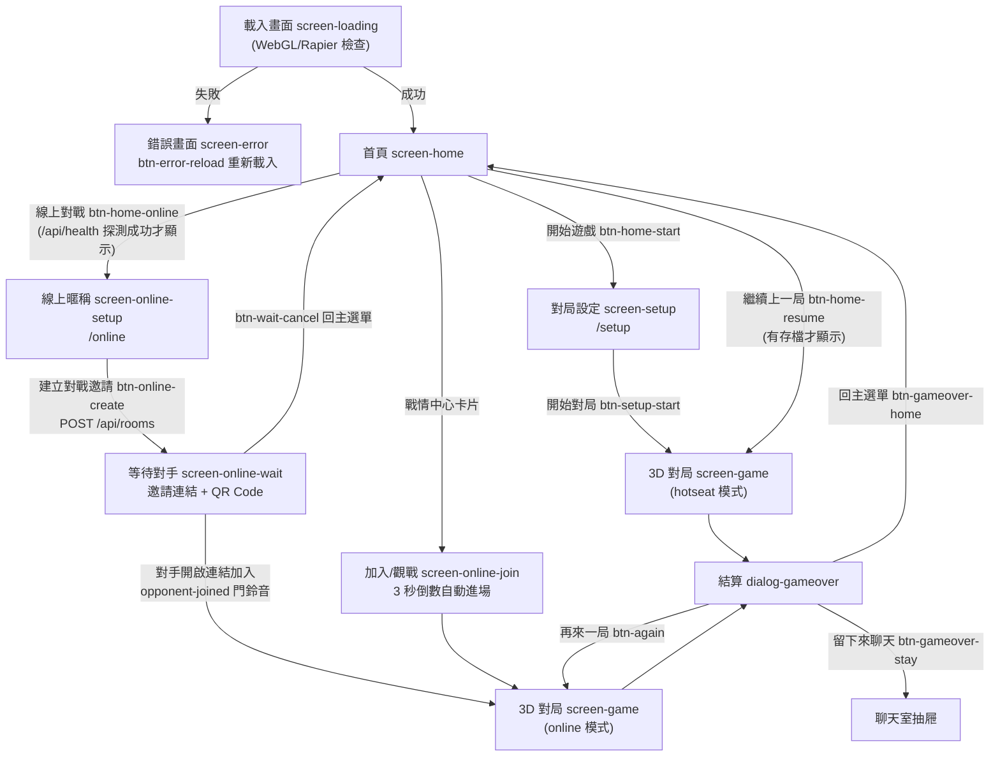
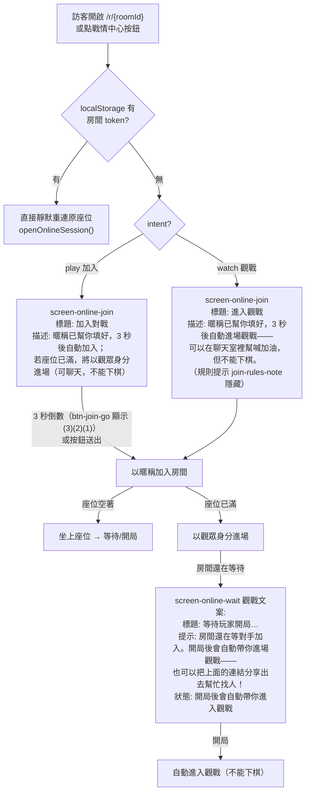
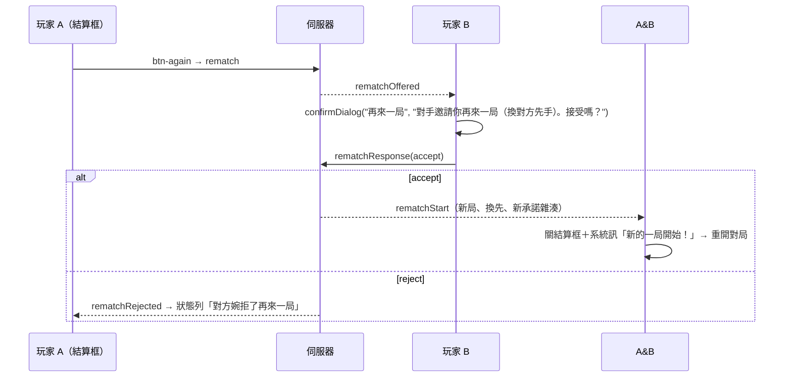

# 05 · 前台規劃（使用者體驗、畫面、互動、視覺與音效）

> 台灣暗棋 3D 網頁遊戲 — 軟體開發規格書 前台章節
> 文件版本：v1.0（對應產品版號 v1.1.33）· 最後更新：2026-08-29
> 本章節以實際原始碼為準：畫面結構 `index.html`、樣式 `src/style.css`、UI 模組 `src/ui/*`、3D 呈現 `src/rendering/*`、物理動畫 `src/physics/*`、輸入橋接 `src/controller.ts`、流程編排 `src/app.ts`、音效 `src/audio/sounds.ts`。

---

## 1. 前台設計原則

| 原則 | 落實方式 | 依據 |
| --- | --- | --- |
| Mobile First | 預設樣式為行動版（bottom sheet 抽屜），`@media (min-width: 1024px)` 才啟用桌面三欄配置 | `src/style.css` |
| 電影感木質桌面 | 全程式化 Canvas 貼圖（木紋、暗角、雕格），無外部圖檔（除首頁背景） | `src/rendering/textures.ts` |
| 物理只是表現層 | Rapier 只驅動翻棋/吃子動畫，動畫結束硬性回貼邏輯格位，永不影響棋局狀態 | `src/controller.ts` |
| 可及性 | 全按鈕有 `aria-label`、提示以「形狀＋顏色」雙編碼（移動=圓環、吃子=菱形）、支援 `prefers-reduced-motion` | `src/rendering/board.ts`、`src/controller.ts` |
| 純文字渲染防 XSS | 聊天/名單/戰情卡一律以 `textContent` / `createTextNode` 建構 DOM（戰情卡 tag 例外用受控 innerHTML） | `src/ui/chat.ts`、`src/app.ts` |
| 無跳窗式確認 | 一律用 `<dialog>` + `confirmDialog()`（自訂 Promise 確認框），絕不使用 `window.confirm` | `src/ui/dialogs.ts` |
| 惰性計時 | 線上回合计時以伺服器 deadline 時間戳換算（`clockOffset` 校正），setInterval 僅為顯示輔助 | `src/online/session.ts` |

---

## 2. 使用者流程

### 2.1 主流程圖

### 2.2 線上加入 / 觀戰分流

- 修改暱稱（`input-join-name` 的 `input` 事件）即取消倒數並還原按鈕文字（`src/app.ts` `cancelJoinCountdown()`）。
- 暱稱留空時送出，以 `resolveNickname()` 從 36 個趣味暱稱隨機指派（`src/shared/fun-names.ts`）。

---

## 3. 畫面規格

所有畫面皆為 `<section id="screen-*" class="screen">`，由 `src/ui/setup.ts` 的 `showScreen()` 統一切換（同時觸發瀏覽器歷史同步）。

### 3.1 載入畫面 `#screen-loading`

| 元素 | id | 說明 |
| --- | --- | --- |
| 商標圓牌 | `.loading-mark` | 84px 圓形木質棋子造型，內為楷體「暗」字 |
| 進度文字 | `#loading-text` | 依載入階段更新：「正在準備棋盤…」→「正在載入物理引擎…」 |
| 進度條 | `#loading-bar-fill` | 進度：30%（Rapier WASM 載入完成）→ 70%（棋盤準備）→ 100%（`src/app.ts` `boot()`） |

WebGL 不可用 → 直接跳 `screen-error`，文案「你的瀏覽器不支援 WebGL…」；Rapier 初始化失敗 → 「物理引擎初始化失敗…」（`isWebGLAvailable()`、`PhysicsWorld.create()`）。

### 3.2 錯誤畫面 `#screen-error`

`#error-title`（標題）＋ `#error-message`（說明）＋ `#btn-error-reload`（重新載入，`window.location.reload()`）。`showError()` 由 `src/ui/setup.ts` 提供；線上錯誤碼 `room-not-found` 亦導向此畫面並 `history.replaceState(null,'','/')`。

### 3.3 首頁 `#screen-home`

- 背景：`/img/home-bg.webp`（≤960px 改載 `home-bg-1280.webp`）＋由上到下加深的暗色漸層；可垂直捲動。
- 標題區：`.home-eyebrow`「傳統桌上棋戲」→ `.home-title`「台灣暗棋」（楷體，`clamp(56px,16vw,92px)`）→ `.home-subtitle`「TAIWAN DARK CHESS」。
- 按鈕（`.home-actions`，四顆同規格：高 52px、字距 .25em、圓角 12px，僅以配色區分角色）：

| 按鈕 | id | 樣式 | 顯示條件 |
| --- | --- | --- | --- |
| 繼續上一局 | `#btn-home-resume` | `.btn-resume` 朱砂紅漸層 | 有進行中存檔（`loadSavedGame() !== null`） |
| 開始遊戲 | `#btn-home-start` | `.btn-start` 金漆漸層＋hover 掃光 | 恆顯示 |
| 線上對戰 | `#btn-home-online` | `.btn-online` 玉青綠漸層 | `GET /api/health` 成功（GitHub Pages 靜態站自動隱藏） |
| 遊戲規則 | `#btn-home-rules` | `.btn-rules` 虛線紙籤 | 恆顯示 |

- 頁尾：`.home-footnote`（Taiwan Dark Chess Rules v1）、`.home-copyright`（連向 Will 保哥粉專）、`#app-version`（`v1.1.33` 格式）。

#### 3.3.1 戰情中心 `#live-games`（`.war-room-panel`）

僅在 `onlineAvailable` 且房間列表非空時顯示；資料來源：
1. Lobby WebSocket `subscribeLobby` → `t:'lobby'` 推播（`src/app.ts` `ensureLobbySocket()`）；
2. 首頁狀態下每 10 秒 `GET /api/games` 輪詢補刷。

| 元素 | id / class | 說明 |
| --- | --- | --- |
| 雷達脈動點 | `.war-room-radar-pulse` | `radar-blink` 動畫的綠色光點 |
| 標題 | `.war-room-title` | 「即時戰況 · 戰情中心」 |
| 連線徽章 | `#war-room-live-badge` | 「即時連線中」/斷線時「重新連線中…」+ `.disconnected` 紅樣式 |
| 篩選 | `#btn-war-live-only` | 「只看交戰中」toggle，`aria-pressed`；偏好存 localStorage `warRoomLiveOnly` |
| 統計 | `#war-stat-games` / `#war-stat-players` / `#war-stat-spectators` | 進行戰局（status≠finished 數）／在線棋手（進行戰局×2）／即時觀戰（各房 spectators 總和） |
| 卡片列表 | `#live-games-list` | `.war-room-grid`，`repeat(auto-fill, minmax(290px,1fr))`，最高 480px 捲動 |

**戰情卡片 `.war-card`**（`renderLiveGames()`，`src/app.ts`）：

- 標頭：房號 `#` + roomId 後四碼大寫（`.war-room-code`）；狀態 tag：`交戰中`（紅，脈動點）／`等待加入`（黃，脈動點）／`🏁 已結束`（灰，卡片加 `.war-card-ended` 降透明度 0.68，於伺服器保留數分鐘）。附加 tag：`🔥 膠著`（回合 ≥10 且雙方剩子差 ≤1）、`⚔️ 激戰`（總吃子 ≥12）、`👁️ N`（觀戰人數）。
- 對局者列 `.war-commanders`：左（玩家一）右（玩家二）顯示暱稱與「紅方 · 剩 N 兵／黑方 · 剩 N 兵／陣營待定」；中央 `VS` 與「第 N 手」（等待房顯示「等待開局」，右側顯示「等待加入／等你來挑戰」）。
- **戰力天平** `.war-gauge-bar`：紅（`#991b1b→#ef4444`）黑（`#475569→#1e293b`）雙色比例條（寬度 = 各方剩子 ÷ 總剩子，0.4s 過渡）；標籤「戰力天平」＋優勢文字：`紅方兵力領先 (+n)`／`黑方兵力領先 (+n)`／`雙方勢均力敵`（`.war-advantage` 金色）。
- 卡片更新閃光：與前一次快照比較 turnNumber/capturedRed/capturedBlack，有變化即加 `.war-card-updated`（`war-card-flash` 動畫 0.85s）。
- 尾部：等待房顯示「已等待 N 秒 · 點擊直接加入」；其餘「已吃 N 子 · 紅損 X / 黑損 Y」。右側按鈕：等待房＝`加入對戰 ⚔️`（金底 primary，intent=play）；交戰中＝`進入觀戰 ↗`；已結束＝`觀看棋局 ↗`（intent=watch）。
- 篩選後無卡片 → `.war-empty`「目前沒有交戰中的對局」（統計數字維持全伺服器計算）。

### 3.4 同機對局設定 `#screen-setup`（網址 `/setup`）

表單 `#setup-form`（`src/ui/setup.ts`）：

| 欄位 | id | 規格 |
| --- | --- | --- |
| 玩家一名稱 | `#input-p1` | text，maxlength 12，空白預設「玩家一」 |
| 玩家二名稱 | `#input-p2` | text，maxlength 12，空白預設「玩家二」 |
| 先手 | `input[name="first"]` | segmented radio：`p1`（玩家一先手，預設）／`random`（隨機先手） |
| 音效 | `#input-sound` | 自訂 switch，預設開 |

- 進入畫面時自動回填上次設定（`loadSettings()`）。
- 「返回 `#btn-setup-back`」回首頁；送出後 `saveSettings()` → `startNewGame()`（洗牌 + SHA-256 承諾 + `saveGame()`），並提示「本局公平性承諾 SHA-256：xxxx…（選單可驗證）」。

### 3.5 線上暱稱 `#screen-online-setup`（網址 `/online`）

- 欄位 `#input-online-name`（maxlength 12），送出時空白→趣味暱稱。
- `.online-rules-note` 規則提示：「每一步限時 60 秒，逾時判負」「斷線後有 90 秒重連寬限，同一網址即可回到對局」「開局先公布公平性承諾雜湊，結束後可驗證」。
- 「返回 `#btn-online-back`」回首頁；「建立對戰邀請 `#btn-online-create`」送出後變「建立中…」並 disabled（`setCreating()`）。成功後 `saveRoomToken()` 並進入等待畫面。

### 3.6 加入對戰 `#screen-online-join`

見 §2.2。元素：`#join-title`、`#join-desc`、`#input-join-name`、`#join-rules-note`、`#btn-join-home`（回主選單）、`#btn-join-go`（加入對戰／進入觀戰）。倒數期間按鈕文字為「加入對戰 (3)」→ (2) → (1)，1 秒一跳，歸零自動 `submitPendingJoin()`。

### 3.7 等待房間 `#screen-online-wait`

| 元素 | id | 說明 |
| --- | --- | --- |
| 標題 | `#wait-title` | 房主：「等待對手加入…」；觀戰者：「等待玩家開局…」 |
| 提示 | `#wait-hint` | 房主：「把下面的連結（或 QR Code）傳給對手，開啟即可立刻對戰。」 |
| 邀請連結 | `#invite-url` | `<code class="hash-block invite-url">`，連線中顯示「連線中…」 |
| 複製按鈕 | `#btn-copy-invite` | 成功→「已複製！」1.8 秒後還原；失敗→「複製失敗，請長按連結」 |
| QR Code | `#invite-qr` | `qrcode` 動態 import 繪製，168px、margin 1、深 `#201709`／淺 `#efe6d8`；失敗則隱藏 |
| 狀態列 | `#wait-note` | 脈動點 `wait-dot`＋「對手加入後將自動開始」（觀戰：「開局後會自動帶你進入觀戰」） |
| 取消 | `#btn-wait-cancel` | 回主選單 |

實作：`src/ui/online-lobby.ts` `showInvite()`；觀戰文案切換在 `src/app.ts` `onWaiting` callback。

### 3.8 對局畫面 `#screen-game`

#### 3.8.1 3D 棋盤 `#board-container`

- Three.js 場景：背景 `#14100d`、ACES Filmic tone mapping（曝光 1.06）、PCF 陰影；燈光＝半球光（0.65）＋主平行光（`#ffe7c2`，2.6，投影）＋補光（`#bcd0ef`，0.55）。低階裝置（`hardwareConcurrency ≤ 4`）陰影貼圖降為 1024（`src/rendering/scene.ts`）。
- 棋盤：4×8 木紋板（程序化貼圖：格線雕痕、A–H/1–4 座標、格位圓圈、暗角），下方 46×46 深色木桌。
- 棋子：LatheGeometry 斜邊圓棋（半徑 0.4、高 0.24），面貼圖＝盒木底＋雕環＋楷體字（紅 `#a92c1a`／黑 `#26221c`），背面共用地毯紋回字紋；**線上模式未翻開的棋子面材質代換為背面貼圖**（`MaterialLibrary.unknownFace`），伺服器 reveal 時以 `PieceMeshFactory.revealFace()` 換回真面目。
- 攝影機（`src/rendering/camera.ts`）：固定俯視、不可旋轉；直向（aspect<0.95）fov 46、俯角 64°、棋子字轉 90°（pieceYaw=π/2）；桌面（≥1024px）俯角 52°，手機橫向 58°；以迭代法解出距離，預留 HUD 遮罩（桌面 reserveX=315px、直向 reserveY=136px），保證整副棋完整可見。

#### 3.8.2 輸入互動（`src/controller.ts`）

- tap 判定：pointerdown/up 位移 ≤14px 且 ≤700ms；Raycaster 先抓棋子（`userData.pieceId`）再投影棋盤面取格位。
- 點蓋牌 → 送出 `flip`；點己方明棋 → 選取（金環 `#e9c25f`＋可移位綠環 `#8fd6a0`＋可吃子紅菱形 `#e4694b`，並上浮 0.07）；再點一次取消；點目標格/敵棋 → move/capture。
- 不合法操作：`invalid` 音效＋格位紅閃 0.36s＋棋子抖動 0.24s＋提示文字：「還沒輪到你」「不能吃這顆棋」「這不是你的棋子」「這顆棋目前沒有合法動作」。
- 線上模式：動作先送 `actionSink`（WebSocket），`pendingAction` 期間鎖輸入；伺服器 `invalid` 回覆時播放 invalid 音並顯示原因。
- 觀戰者：`inputEnabled=false`，所有點擊忽略。

#### 3.8.3 動畫序列（`AnimationQueue` 串行，輸入期間鎖定）

| 動作 | 序列 |
| --- | --- |
| 開局 intro | 32 顆棋自 +0.85 高度依序（間隔 0.012s）落下（0.3s easeInQuad），落定播放 `place` |
| 翻棋 flip | `flip` 音＋震動 8ms → Rapier 動態體上拋（初速 3.0、重力 22、繞水平軸旋轉 π）→ settle → 0.16s blend 回格位 → `place` 音 |
| 移動 move | 0.24s 位移（拱高 0.2）＋姿態 slerp → `move` 音起、`place` 音落、震動 12ms |
| 吃子 capture | 0.15s 衝刺（easeInQuad）→ `capture` 音＋震動 [18,30,24] → 被吃子以物理拋飛（0.8s 後 settle）並縮小移除 → 勝利時 `win` 音 |

`prefers-reduced-motion` 時全部改為短時 blend（無物理拋射）。

#### 3.8.4 HUD

| 元素 | id | 行為 |
| --- | --- | --- |
| 選單按鈕 | `#btn-menu` | 左上漢堡（桌面版隱藏，桌面用右側面板） |
| 回合指示 | `#turn-indicator`（`#turn-color-chip`＋`#turn-text`） | 「玩家名 · 紅方／黑方／陣營未定」；換手時 `.pulse` 金光 0.9s（強制 reflow 重啟動畫）；結束顯示「○○ 獲勝」或「和局」 |
| 計時 | `#hud-timer` | 同機：對局總時長 m:ss（500ms 更新）；線上：本手剩餘秒數（`.countdown` 金色，<10s 加 `.countdown-urgent` 紅色 `countdown-pulse` 閃爍） |
| 無吃子計數 | `#hud-nocapture` | 「無吃子 N/25」，≥20 時 `.warn` 金色加粗 |
| 對手狀態 | `#opponent-status` | 僅線上：對手斷線時顯示「對手已斷線」 |
| 全螢幕 | `#btn-fullscreen` | **桌面版專屬**，固定畫面右上角（右側面板上方）；展開／壓縮雙圖示（`#fs-icon-expand`／`#fs-icon-compress`）隨 `fullscreenchange` 切換；手機版 CSS `display:none` |

提示列 `#hud-hint`（行動版底列、桌面版隱藏）：`showHint()` 顯示訊息，2.6 秒後自動清空。

#### 3.8.5 被吃棋子 `#hud-captured`

兩列（紅／黑）：色圓章（`.chip-red`「紅」／`.chip-black`「黑」）＋被吃子圓片（`.captured-piece`，楷體字）＋右側 `#remaining-red`／`#remaining-black`「剩 N」（16−被吃數；**由吃子數推導，線上模式不受蓋牌 redact 影響**）。行動版為可橫向滑動細條（top=hud 下緣）；桌面版成為左上 300px 寬戰況看板（top 128px），並設 `z-index:7` 確保浮於聊天抽屜之上。

#### 3.8.6 對局紀錄（雙形態）

- **桌面側欄 `#panel-side`**（≥1024px）：右側 280px 面板，含標題「對局紀錄」＋收合按鈕 `#btn-side-history`（箭頭旋轉、`aria-expanded`、收合狀態存 localStorage `sideHistoryCollapsed`；收合僅藏清單，按鈕區保留）與操作列：`#btn-side-rules` 遊戲規則、`#btn-side-fairness` 公平性、`#btn-side-restart` 重新開始（僅同機）、`#btn-side-leave` 離開遊戲。
- **行動抽屜 `#history-drawer`**（<1024px）：底部 bottom sheet（max-height 55%、圓角上緣、`drawer-in` 上滑動畫），由 `#hud-bottom` 的「紀錄 `#btn-history`」開關、`#btn-history-close` 關閉；清單 `#history-list-mobile`。
- 紀錄格式（`src/ui/history.ts`）：`翻開 紅炮 B3`／`帥 A1 → A2`／`帥 A1 ✕ 卒 B2`（吃子列紅色強調）；回合序號左欄；結束時附加高亮結論列（「終」字徽章＋`🏆 ○○ 獲勝 · 理由`／`🤝 和局 · 理由`）。桌面與行動清單同步渲染並自動捲至最新。

#### 3.8.7 選單 `#dialog-menu`

按身分顯示不同項目（`body.mode-online` 切換 `.online-only`／`.hotseat-only`）：

| 項目 | id | 模式 |
| --- | --- | --- |
| 音效：開／關 | `#btn-menu-sound` | 兩用（同步 `saveSettings`） |
| 遊戲規則 | `#btn-menu-rules` | 兩用 |
| 公平性驗證 | `#btn-menu-fairness` | 兩用（線上讀 session 的 fairnessHash/gameOverInfo） |
| 雙方同意和棋 | `#btn-menu-draw` | 僅同機（confirm 後 `agreeDraw()`） |
| 重新開始 | `#btn-menu-restart` | 僅同機（對局中需 confirm「目前棋局將被清除…」） |
| 複製邀請連結 | `#btn-menu-copylink` | 僅線上（`navigator.clipboard`，失敗 fallback 以 hint 顯示網址） |
| 提出和棋 | `#btn-menu-offer-draw` | 僅線上、入座玩家（提示「已向對手提出和棋，等待回應」＋聊天系統訊） |
| 認輸 | `#btn-menu-resign` | 僅線上、入座玩家（confirm「確定要認輸嗎？…」） |
| 結束對戰 | `#btn-menu-abort` | 僅線上、入座玩家；對手在線→徵詢同意，離線→直接結束（皆不計勝負） |
| 離開遊戲 | `#btn-menu-leave` | 兩用；線上入席時文案提醒「離開後隨時可用同一個網址回到對局（若輪到你走棋，請注意限時）」 |

#### 3.8.8 聊天室與人員名單（線上限定）

- 開關：浮動按鈕 `#btn-chat`「聊天」（行動版右下、桌面版左下；展開時桌面版按鈕隱藏）；未讀紅點徽章 `#chat-unread`（上限顯示 99）。
- 抽屜 `#chat-drawer`：行動版為底部 bottom sheet（max-height 65%）；桌面版錨定左下（350px 寬、高 `min(693px, 100dvh − 340px)`、獨立圓角邊框）。`drawer-in` 進場動畫。
- **雙頁籤**（`#chat-drag-handle` 標題列內，`role=tablist`）：
  - `#tab-chat` 聊天室（含 `#chat-tab-unread` 徽章）→ `#tabpanel-chat`：訊息列 `#chat-list`（左右氣泡 `.mine/.theirs`，罐頭訊息加粗 `.canned`，觀眾署名「○○（觀眾）」，系統訊 `.chat-notice` 置中灰字）、罐頭晶片列 `#chat-canned`、輸入表單 `#chat-form`（`#chat-input` maxlength 120＋送出）。
  - `#tab-members` 人員（`#members-count` 總人數）→ `#tabpanel-members`：「對戰玩家」區（`#members-players-list`）紅方固定排前，色章 紅/黑/一/二（未定陣營為虛線金章），角色（（紅方）/（黑方）），自己掛「你」徽章；狀態列：`等待加入`（等待中）／`等待接手`（附「接手」按鈕）／`連線中`（綠）／`斷線重連中`（黃）／`離線`（紅）。「觀戰人員」區（`#members-spectators-list`，`#spectators-count-sub` 顯示人數）：以 `Intl.Collator('zh-Hant-TW-u-co-stroke')` **筆畫排序**，**自己永遠置頂**，空列顯示「目前無觀戰人員」。
- **罐頭訊息**（`src/shared/canned.ts` 76 句、`src/ui/chat.ts`）：
  - 每 **15 秒**以 Fisher–Yates 全庫重洗，取子集顯示：桌面 18 顆、行動 10 顆（`matchMedia('(min-width:1024px)')`）；重排後保留原橫向捲動位置。
  - 子集輪播讓 76 句池隨時間輪替，避免同一批話語永遠排最前；點擊送出 `canned` 訊息（僅送 id，伺服器以 `cannedText()` 驗證）。
  - 晶片列 `scroll-snap-type: x proximity`、隱藏捲軸。
- **拖曳與縮放**：
  - 標題列按住拖曳（pointer capture；點到按鈕不觸發）；首次拖曳即脫離 CSS 錨點改自由定位（left/top），拖曳範圍限制在視窗內（至少留 72px 寬／48px 高可抓）。
  - 桌面版右下角 `#chat-resize-handle` 斜角握把可縮放（最小 320×260，上限視窗邊界），放開時尺寸存 localStorage `chatDrawerSize`；進對局時還原（僅桌面；行動版一律移除 inline 尺寸改用 CSS bottom sheet）。
  - `Escape` 關閉抽屜（有 `<dialog>` 開啟時讓位給對話框）。
- 桌面版進入對局時抽屜**預設展開**（`beginOnlineGame()`）；切換房間 `reset()` 清空訊息、徽章與自由定位。

#### 3.8.9 重連覆蓋層 `#online-overlay`

斷線且曾連上（`hasConnectedOnce`）且對局畫面可見時顯示全屏半透明遮罩：「連線中斷，重新連線中…」；`connected-elsewhere` 錯誤改顯「你已在其他視窗加入這場對局，此分頁已停用。」（永不覆蓋等待／大廳畫面）。

### 3.9 對話框

| 對話框 | id | 重點 |
| --- | --- | --- |
| 規則 | `#dialog-rules` | Rules v1 全文＋炮規則 ASCII 圖解（`.cannon-diagram` 綠「合法」／紅「非法」示意） |
| 公平性 | `#dialog-fairness` | 進行中僅顯示承諾雜湊 `#fairness-hash`；結束後公開 `#fairness-nonce` 與 `#fairness-layout`（8 欄 32 格初始排列）；「驗證本局公平性 `#btn-verify-fairness`」→「驗證成功：初始排列與開局承諾一致，本局未被更動。」（綠）／「驗證失敗：雜湊值不一致！」（紅） |
| 確認 | `#dialog-confirm` | `confirmDialog(title, message)` 回傳 Promise；開啟時 focus「確認」 |
| 公告 | `#dialog-announcement` | `data-persistent="true"`：Esc/點背後不可關，僅「我知道了 `#btn-announcement-ack`」可關；關閉時回報已讀（`announcementAck`）並記錄 localStorage |
| 結算 | `#dialog-gameover` | 見 §4 |

對話框共用行為（`src/ui/dialogs.ts`）：`.dialog-close` 按鈕與點擊背後關閉；`dialog-in` 浮入動畫；`::backdrop` 模糊暗化。

---

## 4. 結算與「再來一局」

### 4.1 結算對話框 `#dialog-gameover`

- 標題 `#gameover-title`：「○○ 獲勝」（線上 aborted 時為「對戰結束」）或「和局」；副標 `#gameover-subtitle` 為結束原因。
- 統計 `.gameover-stats`：`#stat-turns` 回合數、`#stat-red-captures` 紅方吃子、`#stat-black-captures` 黑方吃子、`#stat-time` 對局時間（m:ss）。
- 線上狀態列 `#gameover-online-status`：和棋/再賽邀請的進度訊息（如「已送出『再來一局』邀請，等待對方同意…」）。
- 按鈕：

| 按鈕 | id | 同機 | 線上玩家 | 線上觀戰者 |
| --- | --- | --- | --- | --- |
| 再來一局 | `#btn-again` | 直接 `startNewGame()` | 送出 rematch 請求＋狀態列等待訊息 | **隱藏** |
| 留下來聊天 | `#btn-gameover-stay` | 隱藏（hotseat） | 關結算框並開聊天室 | 顯示 |
| 驗證本局公平性 | `#btn-gameover-fairness` | 開公平性對話框 | 同左 | 同左 |
| 回主選單 | `#btn-gameover-home` | 回首頁 | 同左 | 同左 |

### 4.2 結束原因文案（`src/shared/protocol.ts` `GAME_OVER_REASON_TEXT`）

| reason | 文案 |
| --- | --- |
| capture | 吃光對方所有棋子 |
| draw | 連續 25 步無吃子，判定和棋 |
| draw-agreed | 雙方同意和棋 |
| timeout | 走棋逾時，判定敗北 |
| forfeit | 斷線逾時未回，判定敗北 |
| resign | 認輸 |
| aborted | 對戰提前結束，不計勝負 |

同機模式結束即 `clearSavedGame()`；對局紀錄尾端附加「終」結論列。

### 4.3 再賽協商流程

- **觀戰者差異**：收到 `rematchOffered` 時不改結算框，改聊天系統訊「👀 玩家正在約『再來一局』——留下來就能觀戰下一場！」＋提示「玩家正在約再來一局，留下來看下一場 🍿」；婉拒時顯示「玩家們先不續戰——留在這裡隨時看下一場！」。
- 結算時聊天室同步推送「🏁 對局結束：…」與「歡迎留在聊天室繼續聊聊剛剛的戰局！」；觀戰者另有「🍿 玩家們可以『再來一局』——留在這裡，下一局開始會自動帶你進場觀戰！」。
- 對手提出和棋／結束對戰：以 `confirmDialog` 徵詢（「對手提出和棋」／「對手想結束對戰」），回應經 `respondDraw/respondAbort`。

---

## 5. 視覺設計系統

### 5.1 主題色票（`src/style.css :root` 與 `index.html` meta）

| Token | 值 | 用途 |
| --- | --- | --- |
| `--bg` | `#191210` | 頁面底色（深咖啡） |
| `--bg-raise` | `#241b17` | 卡片／對話框底 |
| `--bg-panel` | `#2b201b` | 面板底 |
| `--ink` | `#efe6d8` | 主文字（米白） |
| `--ink-dim` | `#b3a692` | 次要文字 |
| `--line` | `#453528` | 邊框 |
| `--accent` | `#c9a45c` | 金色強調（按鈕、焦點、天平優勢） |
| `--accent-ink` | `#201709` | 金底上的深字 |
| `--red` / `--red-soft` | `#c8452f` / `#e0684f` | 紅方／吃子強調 |
| `--black-piece` | `#3a332c` | 黑子 |
| `--ok` / `--warn` / `--danger` | `#6fae7c` / `#d9a441` / `#d1553f` | 狀態色 |
| `theme-color` meta | `#1c1512` | 瀏覽器網址列／狀態列著色 |
| 3D 場景背景 | `#14100d` | `scene.background` |
| 棋面墨色 | 紅 `#a92c1a`／黑 `#26221c` | 棋子字與雕環 |

### 5.2 字型與形狀

- UI 字型：`"PingFang TC", "Noto Sans TC", "Microsoft JhengHei", system-ui, sans-serif`；顯示字型（標題、棋子字）：`"Kaiti TC", "BiauKai", "DFKai-SB", "PingFang TC", serif`（楷書）。3D 貼圖字體同源（`PIECE_FONT`）。
- 圓角：`--radius: 10px`（通用）；對話框/setup 卡 14px；戰情面板 `calc(var(--radius) + 4px)`；膠囊元件 999px。
- 陰影：面板 `0 12px 36px rgba(0,0,0,.65)`＋內 1px 高光；按鈕 `0 3px 12px rgba(0,0,0,.4)`＋`inset 0 1px 0 rgba(255,255,255,.35)`；抽屜上緣 `0 -14px 40px rgba(0,0,0,.55)`。
- 玻璃感：HUD/面板/聊天採 `rgba(20,13,10,.72)` 半透明＋`backdrop-filter: blur(6px)`；戰情面板 blur 12px。
- 首頁按鈕體系：金（開始遊戲，hover 掃光）、朱砂（繼續）、玉青（線上）、虛線紙籤（規則）——同一字型/尺寸/圓角，僅配色與邊框區分。

### 5.3 動畫清單

| 名稱 | 參數 | 套用對象 |
| --- | --- | --- |
| `radar-blink` | 1.8s / 1.2s ease-in-out | 戰情中心雷達點、卡片「交戰中/等待加入」脈動點 |
| `war-card-flash` | 0.85s | 戰情卡片資料更新時的琥珀色邊框閃光 |
| `drawer-in` | 0.22s | 歷史抽屜、聊天抽屜上滑進場 |
| `dialog-in` | 0.18s | 對話框浮入（上移 10px＋縮放 0.98） |
| `wait-blink` | 1.2s | 等待房間狀態點 |
| `countdown-pulse` | 1s | 線上回合计時 <10 秒的紅色閃爍 |
| `.pulse`（turn-indicator） | 0.9s box-shadow | 換手時回合膠囊金光 |
| `.btn-start::after` 掃光 | left −80%→125% | 首頁主按鈕 hover 掃光 |
| `.war-gauge-*` width | 0.4s ease | 戰力天平比例條過渡 |
| 3D 動畫 | 見 §3.8.3 | 翻棋/移動/吃子/開局 |

`prefers-reduced-motion: reduce` 下所有 CSS 動畫與 transition 壓至 0.01ms；3D 動畫同步降級。

---

## 6. 音效與震動

### 6.1 合成音效（`src/audio/sounds.ts`，Web Audio 無外部檔案）

| 名稱 | 合成方式 | 觸發時機 |
| --- | --- | --- |
| `flip` | 高頻 click（1900Hz triangle）＋低頻 thud（240Hz） | 翻棋動畫開始；**分頁隱藏時輪到自己 → 標題閃「🔔 輪到你了！」並播 flip**（`notifyYourTurn()`） |
| `place` | 130Hz thud＋900Hz noise burst | 棋子落定（翻/移/吃完成、開局落盤） |
| `move` | 500Hz noise＋150Hz thud | 移動起手、吃子衝刺 |
| `capture` | 95Hz thud＋1200Hz click＋1400Hz noise | 吃子命中 |
| `win` | C5-E5-G5-C6 琶音 pluck（523.25/659.25/783.99/1046.5，間隔 0.13s） | 吃子致勝動畫完成 |
| `invalid` | 70Hz 低鳴 | 不合法操作、格位閃紅、伺服器拒絕動作 |
| `opponent-joined` | **門鈴音**：E5（659.25）→B5（987.77）雙音 pluck | 線上等待方首次收到對手加入的 `onGameReady`（非重連） |

- 開關：`SoundPlayer.enabled` 綁 `settings.soundEnabled`（setup 開關與選單即時切換）。
- 瀏覽器 autoplay 政策：`AudioContext` 首次播放時才建立並 `resume()`（需使用者手勢）。

### 6.2 震動回饋（`src/audio/haptics.ts`，支援裝置自動降級）

| 動作 | 模式 |
| --- | --- |
| 翻棋 | 8ms |
| 移動 | 12ms |
| 吃子 | [18, 30, 24]ms |

---

## 7. RWD 與行動裝置處理

| 面向 | 規格 |
| --- | --- |
| viewport | `width=device-width, initial-scale=1, viewport-fit=cover, user-scalable=no`；全版面以 `env(safe-area-inset-*)` 縮排（HUD、底部列、抽屜、版權列）；`#app` 高度 `100dvh` |
| 斷點 | **≥1024px 桌面**：左上 HUD 區（300px）＋左上被吃看板（top 128px）＋右側對局紀錄面板（280px，top 58px 讓出右上角）＋左下聊天抽屜（350px）；`#hud-bottom`、`#history-drawer`、`#btn-menu` 隱藏；`#btn-fullscreen` 顯示（右上角，40px）。**<1024px 行動**：頂列 HUD＋被吃細條＋底部「紀錄／提示／聊天」列＋bottom sheet 抽屜；全螢幕按鈕隱藏 |
| 首頁背景 | ≤960px 換 1280 版本圖檔 `home-bg-1280.webp` |
| 小直手機（aspect<0.95） | 攝影機 fov 46、俯角 64°、棋盤長邊沿螢幕縱向、棋子字轉 90° |
| 橫向小手機（max-height 480 且 <1024px） | `#hud-captured` 隱藏、`#hud-meta` 改橫排 |
| 聊天室差異 | 行動=CSS bottom sheet（max-height 65%，禁用 inline 尺寸、無縮放握把）；桌面=自由拖曳＋右下縮放＋尺寸記憶 |
| 罐頭訊息 | 桌面顯示 18 顆、行動 10 顆（15 秒重排時即時判定） |
| 觸控 | `touch-action: manipulation`（防雙擊縮放）、棋盤 canvas `touch-action: none`、body 禁 user-select（輸入框/氣泡/雜湊區塊例外） |
| 降級 | 低階裝置（≤4 執行緒）陰影 1024；WebGL 不支援→錯誤畫面；`prefers-reduced-motion` 全面降噪 |

---

## 8. 持久化（localStorage）一覽

| Key | 寫入者 | 內容 | 用途 |
| --- | --- | --- | --- |
| `taiwan-dark-chess:settings:v1` | `src/persistence/storage.ts` | `{playerNames:[2], firstPlayer:'p1'|'random', soundEnabled}` | 同機設定；線上暱稱亦寫入 `playerNames[0]` |
| `taiwan-dark-chess:game:v1` | 同上 | `{version:1, state, fairness, elapsedMs, savedAt}`（僅 status=playing、board=32 格） | 「繼續上一局」；同機每次狀態變更/隱藏/卸載時存檔，結束即清 |
| `taiwan-dark-chess:online:{roomId}` | `src/online/tokens.ts` | `{token, savedAt}` | 房間座位憑證：同一網址靜默重連原座位（優先於暱稱加入流程） |
| `acknowledgedAnnouncements` | `src/app.ts` | id 陣列（上限保留 50 筆） | 已讀公告，避免重複彈出 |
| `warRoomLiveOnly` | `src/app.ts` | boolean | 戰情中心「只看交戰中」偏好 |
| `sideHistoryCollapsed` | `src/app.ts` | boolean | 桌面對局紀錄側欄收合狀態 |
| `chatDrawerSize` | `src/ui/chat.ts` | `{width, height}`（≥320×260 才採用） | 桌面聊天抽屜尺寸 |

所有讀寫皆包 try/catch：私隱模式／容量不足時功能照常運作，僅不持久化。

---

## 9. 瀏覽器歷史導覽

- 畫面↔網址對應（`src/app.ts` `syncHistoryForScreen()`）：`screen-home`→`/`、`screen-setup`→`/setup`、`screen-online-setup`→`/online`、`screen-online-join`／`screen-online-wait`／`screen-game`（線上）→`/r/{roomId}`。以 `history.pushState` 留下紀錄，避免重複 push 同一路徑。
- **popstate 處理**（`handleHistoryNavigation()`）：
  - `/r/([a-z2-9]{10})`：同一房間 session 仍在（PLAYING/GAME_OVER）→ 直接 `showScreen('screen-game')` 帶回；否則 `joinOnlineRoom(roomId,'play')`。若正在別的對局中則不自動跳入，回首頁。
  - `/online`、`/setup`：僅在 HOME 階段回對應畫面。
  - 其餘（含 `/`）→ `goHome()`（同時關閉非持久對話框、結束線上 session）。
- `main.ts` 進入點：`/r/{roomId}` 直接以 `joinRoomId` 開機（略過首頁）。
- 離開線上房間時 `history.replaceState` 把 `/r/*` 換回 `/`，避免殘留失效網址。

---

## 10. 前台驗收要點（供測試對照）

1. 載入進度條依序推進 30%→70%→100%；無 WebGL／Rapier 失敗皆落到錯誤畫面並可重載。
2. 首頁「線上對戰」按鈕僅在 `/api/health` 可達時出現；戰情中心卡片 tag/天平/按鈕文案隨房間狀態正確切換。
3. 邀請連結開啟後 3 秒倒數自動加入；改一個字即取消倒數；座位滿時自動轉觀眾。
4. 等待方在對手加入瞬間聽到門鈴音並自動進局；觀戰者看到「等待玩家開局…」文案且不能下棋。
5. 翻/移/吃的 3D 動畫與音效/震動一一對應；不合法操作有紅閃＋提示；動畫期間輸入鎖定。
6. 桌面版：全螢幕鈕在右上、紀錄側欄可收合（狀態記憶）、聊天抽屜可拖曳與縮放（尺寸記憶）；行動版：全螢幕鈕隱藏、歷史與聊天皆為 bottom sheet。
7. 線上斷線顯示重連覆蓋層；同一網址（有 token）可靜默回到原座位；分頁隱藏時輪到己方會閃標題「🔔 輪到你了！」。
8. 結算框統計正確；同機「再來一局」直接開新局，線上走邀請-接受制；觀戰者無「再來一局」但有留場文案。
9. 公告對話框只能點「我知道了」關閉，重整後不再彈出。
10. 全站版號（首頁頁腳與對局版權列）與 `package.json` version 一致。