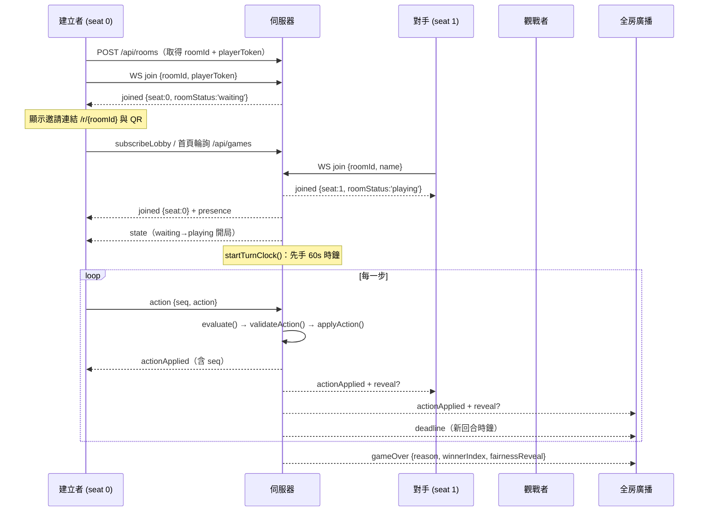
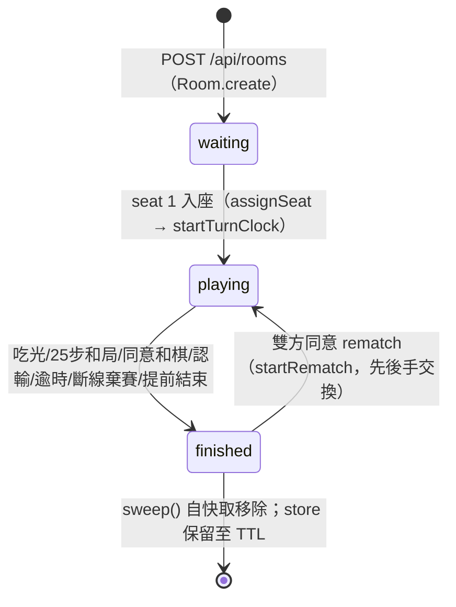
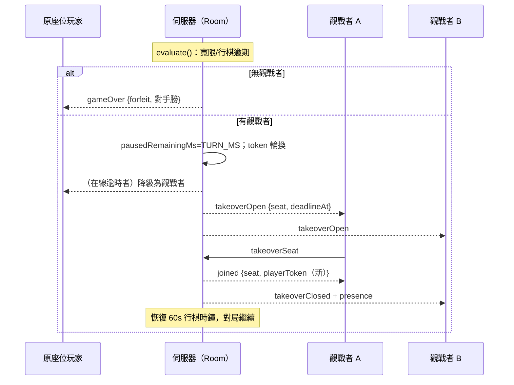

# 06 · 伺服器架構與線上對戰設計（Backend & Online Play）

> 台灣暗棋 3D 網頁遊戲 — 軟體開發規格書 第六章
> 文件版本：v1.0（對應產品版號 v1.1.33）· 最後更新：2026-08-29
> 依據原始碼逐檔分析撰寫：`server/`、`src/online/`、`src/shared/protocol.ts`

---

## 1. 設計總則

線上對戰的一切遊戲狀態由伺服器裁定（server-authoritative），三條不可妥協的鐵則貫穿整個後端：

| 鐵則 | 實踐 | 程式碼位置 |
| --- | --- | --- |
| 蓋牌身分絕不離開伺服器 | 所有下行狀態先經 `redactState()` 遮蔽；棋子 id 為不透明代號 `c00`–`c31`，id 本身不洩漏任何資訊 | `server/redact.ts` |
| 規則引擎 client/server 共用 | `src/game/` 為純函式、零 DOM 依賴；伺服器以 `validateAction()` 驗證後才 `applyAction()` | `server/room.ts:426` |
| 計時以 deadline 時間戳惰性判定 | `evaluate()` 在每個入站訊息、連線事件、房間載入時重算；`setTimeout` 僅為輔助 | `server/room.ts:548` |

WS 協定型別唯一定義於 `src/shared/protocol.ts`，client 與 server 共用 import，兩端永不失同步。

## 2. 伺服器架構

### 2.1 程序結構

單一 Node 程序（`server/index.ts`）同時服務 HTTP 靜態站與 WebSocket：

```
node dist-server/index.mjs            ← Dockerfile CMD（node:22-slim）
├── Express app                       ← 靜態站 + REST API
│   ├── express.static(dist/)         ← Vite 產物
│   ├── /api/* 路由（見 2.3）
│   └── admin 路由（詳見 07-admin.md）
├── http.Server(app)
│   └── server.on('upgrade')          ← 只接受 pathname === '/ws'
└── WebSocketServer({ noServer: true })
    └── RoomManager（server/rooms.ts）
        └── Room ×N（server/room.ts）← 權威 GameState、回合時鐘、廣播
```

關鍵實作細節（`server/index.ts`）：

- **`noServer: true` + 手動 upgrade**：`WebSocketServer` 不綁定 HTTP server，而是在 `server.on('upgrade')` 中先檢查路徑與來源 IP，非 `/ws` 路徑直接 `socket.destroy()`；被封鎖 IP 回寫 `HTTP/1.1 403 Forbidden` 後斷線。通過檢查才 `wss.handleUpgrade()`，並以 `WeakMap` 記錄每條連線的 IP（供封鎖時踢線，close code `4003`）。
- **`app.set('trust proxy', true)`**：Cloud Run 的 TLS 由 Google Front End 終結，真實 client IP 在 `X-Forwarded-For`；`clientIp()` 取第一段作為 IP 監控與封鎖的依據。
- **請求體上限**：`express.json({ limit: '4kb' })`。
- **單程序內的組成元件**：`RoomManager`（房間快取）、`AnnouncementBoard`（公告）、`Metrics`（指標）、`IpMonitor`（IP 監控封鎖），後三者詳見 `07-admin.md`。

### 2.2 部署假設：單一 Instance + Session Affinity

`Makefile` 的 `deploy-run` 目標固定以下參數部署 Cloud Run：

```
gcloud run deploy dark-chess --source . --allow-unauthenticated \
  --session-affinity --timeout 3600 --min-instances 0 --max-instances 1 \
  --memory 512Mi --port 8080
```

| 參數 | 原因 |
| --- | --- |
| `--max-instances 1` | 房間狀態以程序內 `Map` 為權威（RoomManager 快取），多 instance 會分裂狀態；`--session-affinity` 讓同一 client 黏在同一 instance，是 WS 長連線的必要條件 |
| `--timeout 3600` | Cloud Run 會在請求逾時時**連活躍連線一起切斷**，3600 秒是對局長度的上限；因此 client 端的自動重連是「正常運作路徑」而非例外處理（見 4.3） |
| `--min-instances 0` | 閒置時 CPU throttling，`setTimeout` 不可靠 → 造就惰性計時設計（見 6） |
| `--memory 512Mi` | 房間全部在記憶體，靠 TTL 與 sweep 控制成長（見 9） |

`FIRESTORE_ENABLED=0` 時改用 `InMemoryStore`（本機開發/測試，重啟即失），正式環境一律 Firestore。

### 2.3 HTTP API（對外）

| 方法 | 路徑 | 說明 |
| --- | --- | --- |
| GET | `/healthz` | liveness，回 `ok` |
| GET | `/api/health` | 回 `{ok, version}`；client 以此偵測線上模式可用性，部署後驗證版號 |
| GET | `/api/games` | 戰情中心初始列表：`rooms.listGames(20)`（詳見 10） |
| POST | `/api/rooms` | 建立房間：`rooms.create(name)`；body `{name}`（trim 後 12 字，空值給 `randomFunName()` 趣味暱稱）；回 `{roomId, playerToken}` — **seat 0 的 token 由 HTTP 回應直接交付** |
| GET | `/r/{roomId}`、`/online`、`/setup` | 統一回 SPA shell `index.html`，畫面由前端路由切換 |
| GET | `/admin` | 後台 shell（其餘 `/api/admin/*` 見 07-admin.md） |

`roomId` 與各種憑證由 `server/ids.ts` 產生：

| 函式 | 格式 | 用途 |
| --- | --- | --- |
| `newRoomId()` | 10 碼 base32（去 0/1/o/l 易混淆字元） | 房間 id；邀請網址即唯一憑證，`isRoomId()` 以 `/^[a-z2-9]{10}$/` 校驗 |
| `newPlayerToken()` | 16 bytes hex | 座位憑證，斷線後憑 token 重入座 |
| `newChatId()` | 6 bytes hex | 聊天訊息 id |

## 3. 房間管理：RoomManager（server/rooms.ts）

`RoomManager` 是記憶體房間快取 + 存取協調層：

- **`create(creatorName)`**：`newRoomId()` → `Room.create()`（洗牌、承諾雜湊、seat 0 發 token）→ 寫入 store → 通知大廳訂閱者。
- **`get(roomId)`**：快取命中直接回傳（回傳前先 `evaluate()` 惰性結算）；miss 時從 store 載入 `RoomDoc` 並以 `Room.fromDoc()` 重建。**併發載入合併**：`loading` Map 把同房間的並發 `load()` 合併成單一 Promise，避免重啟後兩位玩家同時加入產生兩個分岔的 Room 實例。
- **`sweep()`**：每 60 秒由 `setInterval` 呼叫，把 `finished` 且無連線的房間自快取移除（store 中的文件仍保留至 TTL）。定時器 `.unref()`，不阻礙程序結束。
- **`stats()`**：即時 gauge（進行中/等待房間數、玩家數、觀戰數）供後台指標。
- **`announce(msg)`**：全服公告扇出到記憶體中所有房間；大廳連線另由 `index.ts` 直接發送。

## 4. 連線層

### 4.1 WebSocket 連線路由（server/index.ts `wss.on('connection')`）

每條 WS 連線在程序內綁定**至多一個**房間：

1. 收到訊息先經 `parseClientMessage()`（`server/guards.ts`）驗證，失敗回 `{t:'error', code:'bad-message'}`。
2. `subscribeLobby`：離開目前房間（`room.disconnect(ws)`）、加入 `lobbySockets` 集合，立即補送當前公告與初始 `lobby` 列表（`listGames(50)`）。
3. `join`：離開 `lobbySockets` → `isRoomId()` 校驗 → `rooms.get()` → 舊房間 `disconnect()` → `room.join()`。房間不存在回 `{t:'error', code:'room-not-found'}`。
4. 其餘訊息轉發 `room.handleMessage(ws, msg)`。
5. `close` 時從大廳移除並 `room.disconnect(ws)`。

### 4.2 心跳（keepalive）

`server/index.ts:439`：每 30 秒對所有 client `ping()`；未在上一輪回 `pong` 的連線判定為死連線直接 `terminate()`。動機：Cloud Run 與中介代理會切斷靜默連線。定時器 `.unref()`。

### 4.3 Client 端：ReconnectingSocket（src/online/socket.ts）

- **指數退避重連**：初始 1s，每次斷線後 `delay × 1.7`，上限 10s；連線成功即重設回 1s。
- **`visibilitychange` 觸發立即重試**：回到前景且未連線時立刻 `connectNow()`（蓋過退避等待）。
- **每次 `onOpen` 由 `OnlineSession.sendJoin()` 重送 `join`**（帶 token），伺服器視為同一座位重入——重連協定因此無需 session 恢復指令。
- 畸形 JSON 幀直接忽略；`close()` 時移除 listener 並停止重試。
- 連線狀態經 `onConnectionChanged` 回呼驅動 UI 的「重新連線中」遮罩。

### 4.4 座位憑證（src/online/tokens.ts）

`joined` 訊息中的 `playerToken` 存入 `localStorage`（key：`taiwan-dark-chess:online:<roomId>`，值：`{token, savedAt}`）；重新連線/重整/重開瀏覽器後憑同一 token 重入原座位。隱私模式寫入失敗時靜默降級（同一分頁記憶體內仍可重連）。

## 5. WS 協定完整規格（src/shared/protocol.ts）

每幀為一個 JSON 物件，以欄位 `t` 標記型別。以下逐一列出全部訊息。

### 5.1 共用資料結構

| 型別 | 欄位 | 說明 |
| --- | --- | --- |
| `RedactedPiece` | `id, faceUp, captured, color?, type?` | 蓋中未翻的棋子**不含** `color`/`type` |
| `RedactedStateDTO` | `board, pieces, players, currentPlayerIndex, status, winnerIndex, turnNumber, noCaptureTurnCount, history` | GameState 的公開投影；`history` 本就只記已公開資訊 |
| `TurnDeadline` | `seat, at, serverNow` | `at` 為絕對 deadline（epoch ms）、`serverNow` 供 client 校正時鐘偏差 |
| `ChatMessage` | `id, from(0\|1\|'spectator'), name?, kind('text'\|'canned'), text, cannedId?, at` | `name` 僅觀戰者訊息需要（座位玩家名稱由 state 解析） |
| `GameSummary` | `roomId, status, createdAt, players, capturedRed, capturedBlack, turnNumber, spectators, updatedAt` | 戰情中心列（全部公開資訊） |
| `PieceReveal` | `pieceId, color, type` | 翻牌動作附帶的「該棋子身分揭示」 |
| `PresenceInfo` | `seats: [SeatPresence×2], spectators, spectatorList?` | `SeatPresence = {name, connected, graceDeadlineAt?, awaitingTakeover?}` |
| `FairnessReveal` | `layout, nonce, hash` | 終局揭示的洗牌承諾材料（見 8.4） |
| `RoomStatus` | `'waiting' \| 'playing' \| 'finished'` | 房間狀態機（見 6） |
| `GameOverReason` | `capture, draw, draw-agreed, timeout, forfeit, resign, aborted` | 終局原因；`GAME_OVER_REASON_TEXT` 提供繁中介文字 |

### 5.2 client → server（共 15 種）

| 訊息 | 欄位 | 時機 / 伺服器行為 |
| --- | --- | --- |
| `subscribeLobby` | — | 進入首頁戰情中心；離開房間、加入大廳頻道，隨即補送公告與 `lobby` |
| `join` | `roomId, playerToken?, name?, spectate?` | 由 `/r/{roomId}` 或戰情中心進入；`guards.ts` 限制 roomId ≤24 字、token ≤64、name ≤24；token 命中座位即重入座，否則空座入座或觀戰 |
| `action` | `seq, action` | 走棋（`flip`/`move`/`capture`）；`seq` 由 client 遞增（起始 1，`src/online/session.ts`），伺服器以之回對 `invalid`/回聲 `actionApplied` |
| `chat` | `text` | 自由文字聊天；限流見 11 |
| `canned` | `id` | 罐頭訊息（`src/shared/canned.ts` 76 句白名單）；server 查表轉成文字 |
| `drawOffer` / `drawResponse` | `accept` | 和棋協議；對方已提出時送出 `drawOffer` 直接成立 |
| `abortRequest` / `abortResponse` | `accept` | 提前結束（不計勝負）；**對手離線中送出 `abortRequest` 直接成立**（無人可同意） |
| `resign` | — | 認輸 |
| `rematch` / `rematchResponse` | `accept` | 再來一局協議（僅 `finished` 狀態） |
| `announcementAck` | `id` | 公告已讀回報；大廳連線以「🏠 大廳」名義記帳 |
| `takeoverSeat` | — | 觀戰者接手被棄置的座位（僅 `takeoverOpen` 窗口內有效） |

### 5.3 server → client（共 24 種）

| 訊息 | 欄位 | 時機 |
| --- | --- | --- |
| `lobby` | `games: GameSummary[]` | 大廳訂閱即時戰情；房間異動經 50ms 去抖後廣播（`scheduleLobbyBroadcast`，`server/index.ts:359`） |
| `joined` | `roomId, seat, playerToken?, roomStatus, state, deadline, chat, presence, fairnessHash, gameOver?, announcement?` | join 成功/重連成功/接手成功的完整快照；`seat` 為 `0/1/'spectator'`；已結束房間帶 `gameOver.fairnessReveal`；顯示中的公告要求 client 確認 |
| `state` | `state, deadline` | 對手入座讓房間 `waiting→playing`；以及重連後的完整狀態重放 |
| `actionApplied` | `seq?（僅動作者）, by, action, reveal?, state, deadline` | 合法動作套用後全房廣播；`flip` 附 `reveal` 揭示該子身分 |
| `invalid` | `seq, message` | 動作被拒（非輪到你 / 非法走位 / 對手未入座 / 對局已結束） |
| `chat` | `msg: ChatMessage` | 聊天（含觀戰者，帶 `name`） |
| `presence` | `presence` | 任何人进出房間、斷線、接手時廣播名單 |
| `deadline` | `deadline` | 時鐘啟動/恢復時同步絕對 deadline |
| `drawOffered` / `drawRejected` | `by: seat` | 和棋協議進行中 |
| `abortOffered` / `abortRejected` | `by: seat` | 提前結束協議進行中 |
| `rematchOffered` / `rematchRejected` | `by: seat` | 再賽協議進行中 |
| `rematchStart` | `state, deadline, fairnessHash` | 新對局開始（先後手已交換），client 清除 `gameOverInfo` |
| `gameOver` | `state, reason, winnerIndex, fairnessReveal` | 任何終局；附完整公平性揭示 |
| `announcement` | `id, text, at` | 後台全服公告（房間內經 `rooms.announce`、大廳直接推送） |
| `takeoverOpen` | `seat, deadlineAt, serverNow` | 座位被棄置、開放觀戰者接手（見 7） |
| `takeoverClosed` | `seat` | 座位已被接手，對局恢復 |
| `error` | `code, message` | `ErrorCode = 'room-not-found' \| 'bad-message' \| 'connected-elsewhere' \| 'rate-limited'`；`connected-elsewhere` 同時以 close code `4000` 關閉舊連線 |

### 5.4 完整時序



## 6. 房間生命週期與座位管理（server/room.ts）

### 6.1 狀態機



- `Room.create()`（`server/room.ts:108`）：洗 32 子、id 重編為 `c00`–`c31`、產生 nonce 與 SHA-256 承諾雜湊、`createGame()` 以 `secureRandomInt(2)` 決定先手；seat 0 = 建房者（token 已由 HTTP 回應交付），status = `waiting`。
- `finish()`（`server/room.ts:656`）：除和棋類原因外，將 `state.status` 設為 `'won'` 並寫入 `winnerIndex`，讓 client 的結算畫面一致；清空時鐘與接手窗口。
- `startRematch()`（`server/room.ts:678`）：以 `state.history[0].playerIndex` 找出上一局先手，`opponentIndex()` 交換先後手，整組重新洗牌、重新承諾，廣播 `rematchStart`。

### 6.2 座位管理（`assignSeat()`，`server/room.ts:268`）

入座優先序：

1. **Token 重連（最高優先）**：`playerToken` 命中 seat 0/1 即重入座——即使帶了 `spectate` 意圖也一律還座（「回鍋玩家永遠取回座位」）。若該座位已有**另一條活連線**，舊連線收到 `error: connected-elsewhere` 並被以 close code `4000` 關閉（單座位單連線）。
2. **空位填補**：seat 1 為空且非觀戰意圖 → 填入 seat 1（新 token；名稱 trim 後 12 字，空值給 `randomFunName(avoid)` 避開建房者名稱）。若此時 status 仍為 `waiting`，升級為 `playing` 並 `startTurnClock()`，同時向 seat 0 廣播 `state` 觸發開局。
3. **降級為觀戰**：其餘情況（滿座、觀戰意圖）進入 `spectators` Map（socket → 暱稱 ≤12 字）。

`disconnect()`（`server/room.ts:301`）：觀戰者直接移除；座位玩家把 socket 清空，**若是輪到該玩家行棋且時鐘在跑**，將剩餘秒數凍結進 `pausedRemainingMs` 並啟動 90 秒寬限（見 6.3）——否則 60 秒行棋時鐘恆比 90 秒寬限先到，寬限形同虛設。

## 7. 回合時鐘設計

### 7.1 三個時間量（server/config.ts）

| 常數 | 預設 | 意義 |
| --- | --- | --- |
| `TURN_MS` | 60s（env `TURN_MS`） | 每步思考時限，逾期即敗（先轉入接手流程） |
| `GRACE_MS` | 90s（env `GRACE_MS`） | 斷線寬限：輪到行棋的座位斷線後的重新加入期限 |
| `TAKEOVER_WINDOW_MS` | 5 分鐘 | 觀戰者接手窗口 |

### 7.2 惰性判定 + 輔助計時器（Cloud Run CPU throttling 決策）

房間同時最多存在一個有效期限，存於三個互斥欄位之一：`deadlineAt`（行棋中）、`pausedRemainingMs`（時鐘凍結中，輪到行棋者離線）、`takeover.deadlineAt`（接手窗口）。

- **權威判定 `evaluate()`（`server/room.ts:548`）**：純同步、無副作用風險，可在任何時機呼叫。規則：接手窗口逾期 → `finish('forfeit')`；寬限逾期 → `startTakeover(seat, 'forfeit')`；行棋逾期 → `startTakeover(seat, 'timeout')`。
- **輔助計時器 `armTimer()`（`server/room.ts:630`）**：取三者中最近的期限設定單一 `setTimeout`（+20ms 餘量），觸發後再 `evaluate()`。`.unref()` 確保房間計時器不會拖住程序生命週期。**CPU throttling 下 setTimeout 可能不準甚至不響，因此它只是加速通知的 best-effort nudge；即使整個 timer 失效，下一個入站訊息、任何 `get()`/`listGames()`/`stats()` 呼叫都會補跑 `evaluate()`**。
- **絕對時間戳 + 時鐘校正**：`TurnDeadline` 帶 `serverNow`；client 以 `clockOffset = serverNow - Date.now()` 校正本機時鐘偏差後倒數（`src/online/session.ts setDeadline/tickCountdown`，250ms tick）。
- **重啟還原的寬限處理（`Room.fromDoc`，`server/room.ts:146`）**：重啟後無人連線，且停機非玩家之過——運轉中的行棋時鐘轉入 `pausedRemainingMs = max(deadlineAt - now, 10_000)`（至少留 10 秒）並開一個全新寬限窗；既有的寬限窗也自「現在」重新起算。**停機期間逾期的 deadline 在載入時一律不判負**，只有寬限滿而無人重join才會。

## 8. 殘局接手（Takeover）

### 8.1 觸發條件與流程

對局因「離線超過寬限（forfeit）」或「行棋逾時（timeout）」而即將判負時，`startTakeover()`（`server/room.ts:568`）改為開放座位：

1. **無觀戰者 → 直接判負**：`spectators.size === 0` 時沒有人能接手，立即 `finish(reason, 對手勝)`，行為與舊制相同。
2. **有觀戰者 → 凍結局面、開 5 分鐘窗口**：
   - `pausedRemainingMs = TURN_MS`：接手者獲得一個全新的完整 60 秒回合（接手即先手不虧時鐘）。
   - 逾時**但在線**的玩家被降級：原 socket 移入觀戰者名單（保留暱稱）、座位 socket 清空。
   - **Token 輪換**：`seats[seat].token = newPlayerToken()`——原持有者憑舊 token 永遠無法再取回座位。
   - 廣播 `takeoverOpen {seat, deadlineAt, serverNow}` + `presence`（`awaitingTakeover` 標記）。
3. **觀戰者接手（`takeoverSeat()`，`server/room.ts:593`）**：窗口內任何觀戰者送 `takeoverSeat` → 換新 token、改名、離開觀戰名單 → 凍結的 `pausedRemainingMs` 恢復為 `deadlineAt` 開始倒數 → 該 socket 收到完整 `joined`、其他人收到 `takeoverClosed` + `presence` → 對局繼續。
4. **窗口內無人接手**：`evaluate()` 發現 `takeover.deadlineAt` 逾期 → `finish('forfeit', 對手勝)`。



## 9. 公平性與資訊遮蔽

### 9.1 遮蔽：redactState（server/redact.ts）

**唯一出口**：所有下行 `state` 一律經 `redactState()` 轉成 `RedactedStateDTO`——

- 蓋中且未被吃掉的棋子只留 `{id, faceUp:false, captured:false}`，**無** `color`/`type`；
- 已翻開或已被吃掉的棋子為公開資訊，附完整身分；
- 棋子 id 自建房即為不透明代號 `c00`–`c31`（`Room.newGame` 重編），id 序號與洗牌順序無關聯洩漏；
- `history` 只記錄已公開事件，原樣輸出。

新增任何下行訊息時的鐵律：**先確認不含蓋牌棋子的 color/type**（AGENTS.md）。client 端 `toClientState()`（`src/online/session.ts`）把遮蔽棋子補上哨兵身分（red-pawn）並列入 `hidden` 集合，規則引擎永不讀取蓋牌身分、渲染層以 `hidden` 決定蓋面。

### 9.2 入站驗證：guards（server/guards.ts）

`parseClientMessage()` 對不可信 JSON 做執行期窄化，任何欄位超界即回 `null`（→ `bad-message`）：

- 字串截斷：`roomId ≤24`、`playerToken ≤64`、`name ≤24`、`chat.text ≤500`、`canned.id ≤32`、`announcementAck.id ≤64`、piece id ≤24。
- `action` 的 `seq` 必須是有限數字；`move.to` 的 `row/col` 必須是整數；僅接受 `flip/move/capture` 三種 kind。
- 布林欄位採嚴格 `=== true`。

### 9.3 遊戲合法性：規則引擎

`handleAction()`（`server/room.ts:426`）三層檢查：必須 `playing` 且兩座滿 → 必須輪到該座位 → `validateAction(state, action)`（`src/game/actions.ts`）規則驗證；通過才 `applyAction()`。**規則裁決只在伺服器**，client 的本地引擎僅用於預檢與動畫。

### 9.4 洗牌承諾（commit-and-reveal）

`Room.newGame`（`server/room.ts:132`）：拒絕取樣 Fisher–Yates 洗牌 → `identityLayout`（`color-type` 序列）→ `generateNonce()` + `computeCommitmentHash()`（SHA-256）。`hash` 全程公開（`joined`/`rematchStart` 帶 `fairnessHash`）；`layout + nonce` 僅在終局經 `gameOver.fairnessReveal` 公開，供任何人重算驗證洗牌未作弊。

## 10. 持久化（server/store.ts、server/firestore-store.ts）

### 10.1 RoomDoc

`server/store.ts` 定義還原房間所需的全部快照：

| 欄位 | 內容 |
| --- | --- |
| `version` | `1`（載入時校驗，不符即丟棄） |
| `roomId / status / createdAt / updatedAt` | 房間基本資料 |
| `stateJson` | 完整權威 GameState（JSON 字串；Firestore 不接受 `undefined` 欄位，HistoryEntry 的可選成員會炸，故一律字串化） |
| `fairness` | `{identityLayout, nonce, hash}` |
| `seats` | `[SeatDoc, SeatDoc\|null]`（token + name） |
| `turn` | `{deadlineAt, pausedRemainingMs, graceDeadlineAt}` 三態時鐘 |
| `chatJson` | 聊天尾端 `CHAT_TAIL_LENGTH`(50) 則 |
| `result / finishedAt / takeover` | 結局、終局時間、進行中的接手窗口 |
| `expireAt` | `finished` → `now + FINISHED_ROOM_TTL_MS`(24h)；其餘 → `now + IDLE_ROOM_TTL_MS`(7d) |

### 10.2 Write-through 與序列化

`Room.persist()`（`server/room.ts:761`）：每次狀態變動（join/disconnect/action/chat/finish/rematch/takeover…）即 `toDoc()` 存檔。**`persistChain` 把每個房間的寫入串成單一 Promise 鏈**，慢寫入不會被後續寫入超越（保序）；失敗僅記 log 不中斷對局。`onActivity` 同時觸發大廳廣播。

### 10.3 FirestoreStore（server/firestore-store.ts）

- 一房一文件於 `rooms/{roomId}`；`expireAt` 存為 Firestore `Timestamp`，以集合層 TTL 政策自動清理：
  `gcloud firestore fields ttls update expireAt --collection-group=rooms --enable-ttl`。
- `listActive(limit, now)`：單一欄位查詢 `where('status','in',['playing','finished'])`（**刻意不建複合索引**，取 200 筆後在記憶體內以 `isLobbyListable` 過濾、`byLobbyOrder` 排序、截斷 limit）。

### 10.4 重啟還原

`RoomManager.get()` miss → `store.load()` → `Room.fromDoc()`（`server/room.ts:146`）重建：state、座位 token、聊天尾、時鐘、接手窗口全數還原，並套用 7.2 所述的「重啟寬限」規則後 `evaluate()`。**停機不是玩家的錯**：沒有人會因為重啟而直接被判定負。

## 11. 戰情中心（Lobby / Live Board）

首頁即時戰況列表由三處供給：`GET /api/games`（初次載入，20 筆）、WS `subscribeLobby` + `lobby` 廣播（即時更新，50 筆）。

**列表組成（`RoomManager.listGames()`，`server/rooms.ts:86`）**：

1. 記憶體房間先掃（回傳前 `evaluate()`）——**記憶體是權威**：store 可能停留在異步寫入前的舊狀態，已存在於記憶體的房間一律以記憶體版本為準，store 的舊資料跳過。
2. 再補 `store.listActive()` 中記憶體沒有的房間（重啟後尚未被 join 的房間也能顯示）。
3. `summarizeDoc()` 把 `RoomDoc` 轉成 `GameSummary`（含雙方被吃子數統計）；`playing` 但 seat 1 未入座的房間不顯示。

**曝光規則（`isLobbyListable()`，`server/store.ts:57`）**：

| 狀態 | 曝光條件 |
| --- | --- |
| `playing` | 一律曝光 |
| `waiting` | 建立滿 30 秒（`LOBBY_WAIT_VISIBILITY_MS`）才曝光——私人快速對局不會閃現在大廳，公開等待房讓訪客可加入 |
| `finished` | 終局後保留 5 分鐘（`LOBBY_ENDED_RETENTION_MS`，以 `finishedAt ?? updatedAt` 計）——結果不會在捲動中消失 |

**穩定排序（`byLobbyOrder()`，`server/store.ts:70`）**：以 `createdAt`（永不變動）新→舊排序，同分再比 roomId。行棋過程中 `updatedAt` 持續變動，若以之排序列會跳動；這是 2026-08-28 戰情中心穩定化的關鍵決策。

## 12. 聊天與限流（server/room.ts `handleChat`）

- 對象：**房內所有人（含觀戰者）**；觀戰者訊息 `from:'spectator'` 帶 `name`，座位玩家名稱由 state 解析。
- 消毒：剔除控制字元（保留 ≥32 且非 127）→ trim → 截 120 字（`CHAT_MAX_LENGTH`）。
- 限流（每連線一組 `ChatLimiter`）：10 秒內最多 5 則（`CHAT_BURST`/`CHAT_WINDOW_MS`）且任意兩則間隔 ≥600ms（`CHAT_MIN_GAP_MS`）；超限回 `error: rate-limited`。
- 罐頭訊息：client 只送 id，server 查 `CANNED_MESSAGES` 白名單（76 句）轉文字，`kind:'canned'` 連同 `cannedId` 記錄。
- 容量：記憶體保留尾端 100 則、持久化與 `joined` 補送尾端 50 則（`CHAT_TAIL_LENGTH`）。

## 13. 可調參數總表（server/config.ts）

| 參數 | 預設 | 說明 |
| --- | --- | --- |
| `PORT` | 8787（env `PORT`，Cloud Run 8080） | 監聽埠 |
| `TURN_MS` | 60s（env `TURN_MS`） | 每步時限 |
| `GRACE_MS` | 90s（env `GRACE_MS`） | 斷線寬限 |
| `TAKEOVER_WINDOW_MS` | 5 分鐘 | 觀戰者接手窗口 |
| `LOBBY_WAIT_VISIBILITY_MS` | 30s | 等待房間曝光延遲 |
| `LOBBY_ENDED_RETENTION_MS` | 5 分鐘 | 終局戰情保留 |
| `FINISHED_ROOM_TTL_MS` | 24 小時 | 已結束房間的 store TTL |
| `IDLE_ROOM_TTL_MS` | 7 天 | 未完成房間的 store TTL |
| `FIRESTORE_ENABLED` | 開（env `=0` 時關） | 關閉時用 InMemoryStore |
| `CHAT_BURST` / `CHAT_WINDOW_MS` / `CHAT_MIN_GAP_MS` | 5 / 10s / 600ms | 聊天限流 |
| `CHAT_MAX_LENGTH` / `CHAT_TAIL_LENGTH` | 120 / 50 | 單則長度 / 補送尾端 |

## 14. 相關測試與驗證

`server/tests/`（Vitest）：`room.test.ts`（生命週期/座位）、`takeover.test.ts`（殘局接手）、`timers.test.ts`（惰性時鐘）、`chat.test.ts`（限流/消毒）、`lobby.test.ts`（曝光/排序）、`redact.test.ts`（遮蔽不洩漏）、`announcements/auth/metrics/ip-monitor.test.ts`（後台）。測試以 `ClientSocket` 假介面驅動 Room，無需真實 WebSocket。整體驗證：`npm test` + `npm run typecheck`（client 與 server 雙 tsconfig）。

---

*本文件以原始碼為準撰寫；若程式碼變更，請同步更新對應小節。*