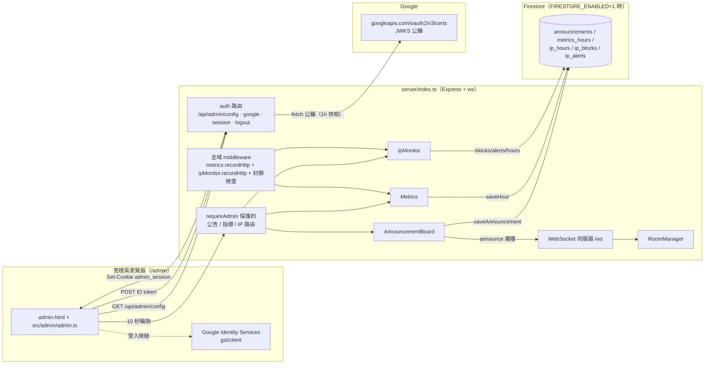
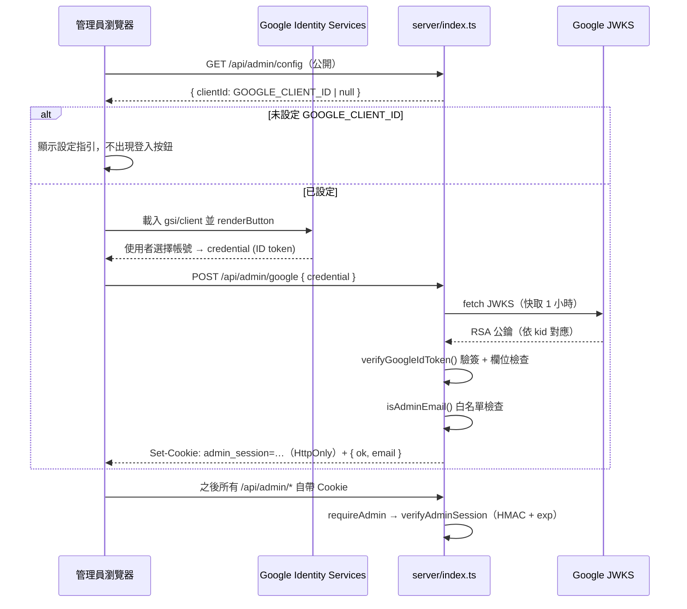
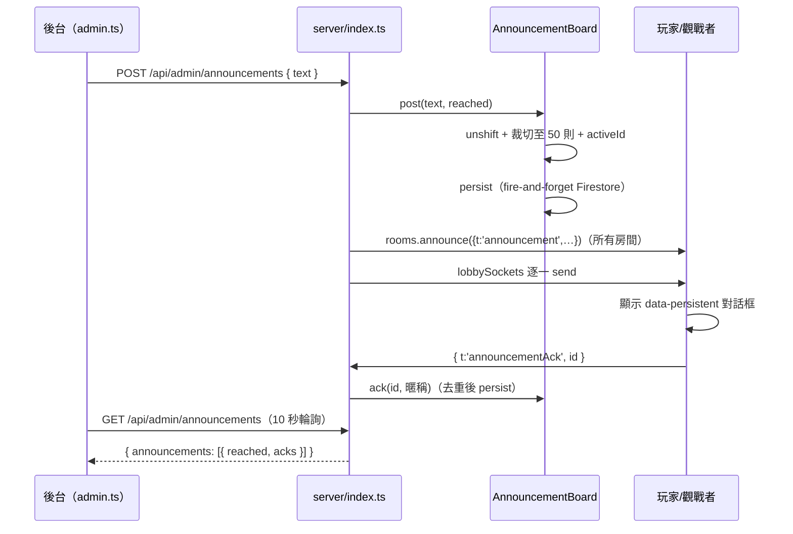

# 07 · 管理後台設計（Admin Console）

> 台灣暗棋 3D 網頁遊戲 — 軟體開發規格書 營運管理後台
> 文件版本：v1.0 · 最後更新：2026-08-29
> 本章內容全部以實際原始碼為準：`admin.html`、`src/admin/admin.ts`、`src/admin/admin.css`、`server/auth.ts`、`server/announcements.ts`、`server/metrics.ts`、`server/ip-monitor.ts`、`server/firestore-admin.ts`、`server/index.ts`。

---

## 1. 總覽與設計原則

管理後台位於 `/admin`（`server/index.ts` 的 `app.get('/admin')` 回傳 `dist/admin.html`），是線上對戰主站（Cloud Run）的營運中樞，提供四大能力：

| 能力 | 說明 | 主要實作 |
| --- | --- | --- |
| 管理員認證 | Google 帳號登入 + 信箱白名單 + 簽章 Cookie | `server/auth.ts` |
| 全服公告 | 即時推播到所有房間與大廳，玩家強制點「我知道了」，可追蹤已讀人數 | `server/announcements.ts` |
| 伺服器指標 | 即時快照 + 分鐘/小時/日三種粒度的負載趨勢報表 | `server/metrics.ts` |
| IP 監控與封鎖 | per-IP 流量統計、異常告警、時限/永久封鎖 | `server/ip-monitor.ts` |

設計原則：

1. **零外部認證依賴**：不引入 Passport、Firebase Auth、Auth0 等任何第三方認證套件。瀏覽器端用 Google Identity Services（GIS）取得 ID token，伺服器用 Node 內建 `node:crypto` 對 Google JWKS 公鑰驗簽（RS256），再自簽 HMAC session cookie（`server/auth.ts` 模組註解明言「No external auth dependency」）。依賴越少，Cloud Run 容器越小、供應鏈風險越低。
2. **後台與玩家同一行程式**：admin 路由與遊戲 WS 伺服器共處於 `server/index.ts`，直接讀取記憶體中的 `RoomManager`、`AnnouncementBoard`、`Metrics`、`IpMonitor`，無需內部 API 或第二個服務。
3. **管理員不可被自己鎖在外面**：IP 封鎖 middleware 明確放行 `/admin`、`/api/admin`、`/healthz`、`/api/health`（`server/index.ts` 註解：「封鎖不影響後台自身與健康檢查，管理員不會把自己鎖在外面」）。
4. **重啟後狀態盡量還原**：公告歷史、小時指標、IP 封鎖名單與告警在啟動時自 Firestore 載回（`announcements.init()`、`ipMonitor.init()`；`Metrics` 的小時資料採查詢時合併）。
5. **頁面不可索引**：`admin.html` 設有 `<meta name="robots" content="noindex,nofollow">`。

---

## 2. 系統架構



資料持久化由 `FirestoreAdminStore`（`server/firestore-admin.ts`）一個類別同時實作三個介面：`AnnouncementPersistence`、`MetricsPersistence`、`IpMonitorPersistence`，共五個 Firestore 集合：

| 集合 | 文件 ID | 內容 |
| --- | --- | --- |
| `announcements` | 公告 UUID | 公告全文、時間、送達人數、已讀名單（`acks` 陣列） |
| `metrics_hours` | ISO 小時（`YYYY-MM-DDTHH`，`hourDocId()`） | `HourPoint` 小時彙整 |
| `ip_hours` | `${ip}_${ISO 小時}`（`ipHourDocId()`） | per-IP 每小時流量 |
| `ip_blocks` | IP 位址本身 | 封鎖紀錄（含 `blockedBy` 管理員信箱） |
| `ip_alerts` | 告警 UUID | 異常警示（保留 7 天，批次刪除上限 300 筆） |

---

## 3. 認證設計

### 3.1 登入流程



### 3.2 GIS ID token 驗證（`server/auth.ts` `verifyGoogleIdToken()`）

伺服器不使用任何 JWT 函式庫，以 `node:crypto` 手工完成 RS256 驗簽，檢查順序與失敗行為（全部回傳 `null`）：

| # | 檢查項目 | 實作 |
| --- | --- | --- |
| 1 | token 為三段 base64url（header.payload.signature） | `credential.split('.')` 長度檢查 |
| 2 | `header.alg === 'RS256'` 且有 `kid` | 防止 `none`/HS256 混淆攻擊 |
| 3 | 依 `kid` 自 Google JWKS 取得公鑰（`kty=RSA`、`n`、`e`），`createPublicKey({ format: 'jwk' })` | `fetchGoogleJwks()`，`JWKS_URL = https://www.googleapis.com/oauth2/v3/certs`，快取 `JWKS_TTL_MS = 1 小時` |
| 4 | `createVerify('RSA-SHA256').verify()` 驗證簽章 | 針對 `header64.payload64` 原文 |
| 5 | `payload.exp` 為數字且未過期（`exp * 1000 > now`） | 拒絕過期 token |
| 6 | `iss` 為 `accounts.google.com` 或 `https://accounts.google.com` | 發行者檢查 |
| 7 | `aud === GOOGLE_CLIENT_ID` | 受眾檢查，防 token 重放他處 |
| 8 | `email_verified === true` 且 `email` 為字串 | 只接受已驗證信箱 |

通過後回傳 `GoogleIdentity { email（轉小寫）, name, sub }`。

### 3.3 管理員白名單（`ADMIN_EMAILS`）

- `adminEmailsFromEnv()` 讀取環境變數 `ADMIN_EMAILS`（逗號分隔），逐一 `trim().toLowerCase()`；**未設定時預設只有 `doggy.huang@gmail.com`**。
- `isAdminEmail(email, allowed)` 在兩個地方把關：`POST /api/admin/google` 發 cookie 前，以及 `currentAdminSession()`（`server/index.ts`）驗 cookie 時再次比對——即使 cookie 被偽造，信箱不在白名單依然拒絕。
- 白名單外的帳號登入回 `401 { error: 'not-admin', message: '此 Google 帳號沒有管理員權限' }`。

### 3.4 HMAC session cookie

| 項目 | 值 | 來源 |
| --- | --- | --- |
| Cookie 名稱 | `admin_session`（`ADMIN_COOKIE`） | `server/auth.ts` |
| Token 格式 | `base64url(JSON{email, exp}) + '.' + base64url(HMAC-SHA256(body, secret))` | `signAdminSession()` |
| 有效期 | `ADMIN_SESSION_TTL_MS = 12 小時` | 同上 |
| Cookie 屬性 | `Path=/; HttpOnly; Secure; SameSite=Lax; Max-Age=43200` | `adminCookieHeader()` |
| 驗證 | `verifyAdminSession()`：`lastIndexOf('.')` 切分、`timingSafeEqual()` 常數時間比較 MAC、`exp <= now` 即失效 | 同上 |
| 登出 | `POST /api/admin/logout` → `clearAdminCookieHeader()`（`Max-Age=0`） | `server/index.ts` |
| 密鑰 | `ADMIN_SESSION_SECRET` 環境變數；未設定時 `randomSecret()`（`randomBytes(32)` hex）**每次重啟隨機**——重啟即全員登出（模組註解：「restarts sign everyone out, which is fine for a console this small」） | `server/index.ts` |

`HttpOnly` 使 XSS 讀不到 token；`Secure` 配合 Cloud Run 的 TLS 終結；`SameSite=Lax` 允許從 Google 登入跳回後正常帶上 cookie，同時抵擋跨站 POST。

### 3.5 為何零外部認證依賴

- **攻擊面最小化**：後台只有一個頁面與少數 API，不需要完整 OAuth flow / refresh token / 使用者資料庫；GIS 按鈕 + 一次性 ID token 驗證即可。
- **供應鏈與維運成本**：不新增 npm 套件（`passport`、`google-auth-library` 等），JWKS 快取與 RS256 驗簽共約 80 行（`server/auth.ts`），行為完全可控且可測（`server/tests/auth.test.ts` 以注入 `deps.fetchCerts` / `deps.now` 測試）。
- **無狀態 session**：HMAC cookie 不需伺服端 session 儲存，Cloud Run 多實例/縮放皆可用。

### 3.6 相關環境變數

| 變數 | 說明 | 未設定時 |
| --- | --- | --- |
| `GOOGLE_CLIENT_ID` | OAuth 網頁用戶端 ID（ID token 的 `aud`） | 登入頁顯示設定指引，不出現 Google 按鈕 |
| `ADMIN_EMAILS` | 逗號分隔的管理員信箱白名單 | 預設 `doggy.huang@gmail.com` |
| `ADMIN_SESSION_SECRET` | session cookie 的 HMAC 密鑰 | 每次重啟隨機產生（重啟即登出） |

---

## 4. 全服公告

### 4.1 資料模型（`server/announcements.ts`）

```ts
interface AnnouncementRecord {
  id: string          // randomUUID()
  text: string        // 公告內容（最長 500 字）
  at: number          // 發送時間 epoch ms
  reached: number     // 發送當下送達的連線人數
  acks: Set<string>   // 已讀者名稱集合（去重）
}
```

`AnnouncementBoard` 同一時間只有一則「現行公告」（`current()`）：發新公告會把 `activeId` 指向新紀錄；歷史以 `unshift` 維護，**上限 `HISTORY_LIMIT = 50` 則**，超過即裁切。

### 4.2 發送流程（`POST /api/admin/announcements`）

`server/index.ts` 的處理順序：

1. **文字消毒**：以 `Array.from(raw)` 逐 code point 過濾控制字元（`code >= 32 && code !== 127`），`trim()` 後 `slice(0, 500)`；淨空則 `400 { error: 'empty-text' }`。
2. **計算送達人數**：`reached = rooms.stats().players + spectators + lobbySockets.size`（房內玩家 + 觀戰者 + 大廳連線）。
3. **寫入看板**：`announcements.post(text, reached)`（同步記憶體 + 非同步 Firestore `saveAnnouncement`）。
4. **廣播**：`rooms.announce({ t: 'announcement', id, text, at })` 對所有房間（玩家與觀戰者）廣播；再對 `lobbySockets` 每一條 OPEN 連線逐一 `send`。
5. 回應 `{ ok: true, announcement: { id, text, at, reached, acks: 0 } }`。



### 4.3 玩家端：必須點「我知道了」

- 公告對話框 `index.html` 的 `<dialog id="dialog-announcement" data-persistent="true">`。
- `src/ui/dialogs.ts` `setupDialogs()`：`data-persistent` 的對話框攔截 `cancel` 事件（**Esc 無效**），且不掛背景點擊關閉——**只能按「我知道了」按鈕**（`showAnnouncementDialog()` 的 `btn-announcement-ack.onclick`）。
- `src/app.ts`：`showAnnouncement()` 先查 `ackedAnnouncements`（localStorage `acknowledgedAnnouncements`，容量 50）已讀則不再打擾；點擊確認後記錄並送出回執——房間內經 `src/online/session.ts` `sendAnnouncementAck(id)`，大廳直送 `{ t: 'announcementAck', id }`。

### 4.4 已讀回執與去重

- 房間內：`server/room.ts` 收到 `announcementAck` 後，以座位名稱（觀戰者用其暱稱）呼叫 `deps.onAnnouncementAck(id, name)` → `announcements.ack()`。
- 大廳：`server/index.ts` 對尚無房間的連線直接 `announcements.ack(msg.id, '🏠 大廳')`。
- `AnnouncementBoard.ack(id, name)`（`server/announcements.ts`）：未知公告 id 或空名稱忽略；**同一名稱重複 ack 直接忽略**（`record.acks.has(name)`），確保「已讀 x/y」不會灌水。

### 4.5 新加入者與重啟還原

- **新加入者補看**：`RoomManager` 建構時注入 `activeAnnouncement()`（`server/index.ts`）；房間的 `join`、`takeoverSeat` 等狀態下行訊息皆附帶 `announcement` 欄位（`server/room.ts`，協定型別見 `src/shared/protocol.ts` 的 `AnnouncementInfo { id, text, at }`），玩家加入時若公告仍在展示中就會收到並需確認。大廳端 `subscribeLobby` 時也會立刻補發現行公告。
- **重啟還原**：`announcements.init()` 於伺服器啟動時 `loadAnnouncements(50)` 載回歷史（`acks` 由陣列還原為 `Set`），`activeId` 指向最新一則；載入失敗僅記 error 不中斷啟動（best-effort）。

---

## 5. 伺服器指標（`server/metrics.ts`）

### 5.1 資料結構與保留期

| 層級 | 儲存 | 保留 | 持久化 |
| --- | --- | --- | --- |
| 分鐘桶 `MinuteBucket` | 記憶體 `Map`（`metrics.minutes`） | `MINUTE_RETENTION_MS = 72 小時` | 不持久化 |
| 小時彙整 `HourPoint` | 記憶體 `Map`（`metrics.hours`） | `HOUR_RETENTION_MS = 90 天` | Firestore `metrics_hours`（變動時 `saveHour`） |
| 日報表 | 由 `seriesDay()` 即時聚合 | — | — |

### 5.2 分鐘桶欄位

| 欄位 | 意義 | 來源 |
| --- | --- | --- |
| `http` / `wsMsg` | 該分鐘 HTTP 請求數 / WS 訊息數 | middleware `metrics.recordHttp()`、WS `recordWsMessage()` |
| `connPeak` / `connAvg` | 連線數峰值 / 平均（玩家+觀戰+大廳） | 每 5 秒 gauge 取樣（`sample()`） |
| `playersPeak` `spectatorsPeak` `lobbyPeak` | 玩家/觀戰/大廳峰值 | 同上（gauge 由 `rooms.stats()` + `lobbySockets.size` 組成） |
| `roomsPlayingPeak` `roomsWaitingPeak` | 交戰中/等待房間峰值 | 同上 |
| `lagP95` / `lagMax` | Event-loop 延遲 p95 / 最大值（ms） | `monitorEventLoopDelay({ resolution: 20 })` 的 `mean`，每次取樣後 `reset()`，`percentile95()` 計算 |
| `cpuAvg` / `cpuPeak` | CPU 使用率平均/峰值（單一 vCPU 0–100%） | `sampleCpu()`：兩次取樣的 `process.cpuUsage()` 差 ÷ 真實經過時間 |
| `rssPeak` / `heapPeak` | RSS / heapUsed 峰值 | `process.memoryUsage()` |

### 5.3 取樣與彙整循環（`start()` / `sample()` / `collect()`）

- `start(collectIntervalMs = 60_000, sampleIntervalMs = 5_000)`：每 **5 秒**取一次樣（gauge、記憶體、CPU、lag），每 **60 秒** `collect()` 結算分鐘桶。所有 timer 皆 `unref()`，不阻止 Cloud Run 縮容。
- `collect()` 將 `PartialMinute` 結算成 `MinuteBucket`：`connAvg = Σ(玩家+觀戰+大廳)/樣本數`、`lagP95`、`cpuAvg = cpuSum/cpuSamples`；隨後 `rollupHour()` 將該小時內所有分鐘桶彙整為 `HourPoint`（`lagP95Max`、`cpuPeak`、`cpuSum` 供小時平均 = `cpuSum / samples`），並裁切 72 小時前的分鐘桶。
- `maybeUpsertHour()`：進行中的小時每 **5 分鐘**強制重寫一次 Firestore，讓後台圖表即時但不打爆 store。
- **CPU throttling 對策**：與遊戲計時同樣的鐵律——指標以時間戳差值計算（CPU% 用 wall time、lag 用 `monitorEventLoopDelay`），不依賴 setInterval 的準確性。

### 5.4 台北時間分日

- `dayKey(t)`：`new Date(t + TAIPEI_OFFSET_MS).toISOString().slice(0, 10)`（`TAIPEI_OFFSET_MS = 8 小時`）——**每日報表一律以台北時間（UTC+8）切日**，避免 UTC 切日造成「台灣晚間 8 點後算隔天」的錯位。
- `seriesDay(from, to)`：先取小時序列，再按 `dayKey` 聚合（`http/wsMsg/cpuSum` 累加、峰值類取 max、`connSum` 累加供算平均連線）。

### 5.5 查詢合併邏輯（`seriesHour()`）

記憶體與 Firestore 兩份資料合併：同一小時**以 `samples` 較大者為準**（重啟後 Firestore 的完整小時贏過重啟後記憶體中的半截小時）。

---

## 6. 即時快照 API

### 6.1 `GET /api/admin/metrics/live`

回傳 `{ version: APP_VERSION, ...metrics.live() }`。`Metrics.live()` 回傳 `LiveSnapshot`：

```ts
{ players, spectators, lobby, roomsPlaying, roomsWaiting,  // 即時 gauge
  lagMs,      // 最近一次取樣的 event-loop 延遲（1 位小數）
  cpuPct,     // 即時 CPU%（單一 vCPU）
  rssMb, heapMb, uptimeSec }
```

### 6.2 `GET /api/admin/metrics/series?granularity=&from=&to=`

| 參數 | 預設 | 說明 |
| --- | --- | --- |
| `granularity` | `minute` | `minute` / `hour` / `day`（其他值視為 minute） |
| `from` | `to - 1 小時` | epoch ms 起始 |
| `to` | `Date.now()` | epoch ms 結束 |

回傳 `{ granularity, points }`：minute → `seriesMinute(from, to)`（純記憶體）；hour → `await seriesHour()`（記憶體+Firestore 合併）；day → `await seriesDay()`（依台北日聚合）。

---

## 7. IP 監控與封鎖（`server/ip-monitor.ts`）

### 7.1 流量記錄

- HTTP：全域 middleware 對每個請求 `ipMonitor.recordHttp(ip)`；IP 取自 `X-Forwarded-For` 第一個位址（`clientIp()`，搭配 `app.set('trust proxy', true)`——Cloud Run 於 Google Front End 終結 TLS，真實 IP 在此 header）。
- WS：`server.on('upgrade')` 解析 IP 後記入 `wsIps`（`WeakMap<WebSocket, string>`）；連線建立 `recordWsConnect()`（`concurrent` 計數 + `connEvents`）、每則訊息 `recordWsMessage()`、斷線 `recordWsDisconnect()`。
- 內部結構：每個 IP 一張 `IpRecord`（累計值 + `currentMinute` 分鐘計數 + 7 天小時桶）；**記憶體上限 `MAX_TRACKED_IPS = 5,000`**，超過或超過 `IP_RETENTION_MS = 7 天` 未活動即裁切（`prune()`）。

### 7.2 異常閥值與告警（`evaluateAlerts()`）

單一 IP 超過閥值即產生告警（**供人類判斷，不自動封鎖**）。閥值皆可用環境變數調整：

| 告警類型 | 預設閥值 | 環境變數 |
| --- | --- | --- |
| `http-flood`（HTTP 洪水） | 單分鐘 HTTP > 120 次 | `IP_ALERT_HTTP_PER_MIN` |
| `ws-flood`（WS 訊息洪水） | 單分鐘 WS 訊息 > 600 則 | `IP_ALERT_WS_PER_MIN` |
| `conn-storm`（連線風暴） | 單分鐘 WS 連線 > 10 條 | `IP_ALERT_CONN_PER_MIN` |
| `http-hourly`（HTTP 時流量異常） | 單小時 HTTP > 2,000 次 | `IP_ALERT_HTTP_PER_HOUR` |

告警機制：

- 分鐘滾動時（`record()` 與每分鐘 `collect()`）評估上一分鐘：分鐘級三項 + 該小時累積 HTTP。
- **去重**：`pushAlert()` 對「同一 IP + 同一類型」**5 分鐘內只記一筆**，避免洗爆告警列表。
- 歷史上限 `ALERT_HISTORY_LIMIT = 200` 筆，並持久化至 `ip_alerts`、重啟時 `loadIpAlerts(200)` 還原。
- 後台顯示名稱對照（`src/admin/admin.ts` `IP_ALERT_TYPE_TEXT`）：HTTP 洪水 / WS 訊息洪水 / 連線風暴 / HTTP 時流量異常，列表顯示最近 20 筆。

### 7.3 Top 10 表格

`ipMonitor.top(rangeMs, now, limit = 10)`：加總視窗內每個 IP 的小時桶（含進行中的 `currentMinute`），依 `http + wsMsg` 總量排序取前 10。視窗由 `GET /api/admin/ip-stats?range=` 決定：`1h` / `24h`（預設）/ `7d`。每列含 IP、HTTP 請求、WS 訊息、WS 連線事件、目前併發連線、`firstSeen`/`lastSeen`、封鎖狀態與到期時間。

### 7.4 封鎖機制

```mermaid
flowchart TD
    A[管理員點「封鎖」或手動輸入 IP] -->|POST /api/admin/ip-blocks { ip, duration }| B{驗證}
    B -->|ip 非法| C[400 bad-ip<br/>需 IPv4 / IPv6，≤45 字元]
    B -->|duration 非法| D[400 bad-duration]
    B -->|通過| E[ipMonitor.block(ip, duration, adminEmail)]
    E --> F[寫入記憶體 blocks + Firestore ip_blocks]
    F --> G[踢線：wss.clients 中 wsIps 相同者<br/>client.close(4003, 'ip-blocked')]
    H[任何後續請求] --> I{middleware:<br/>路徑非 admin/health 且 isBlocked?}
    I -->|是| J[HTTP 403 ip-blocked]
    I -->|否| K[正常處理]
    L[WS upgrade /ws] --> M{isBlocked?}
    M -->|是| N[寫 HTTP/1.1 403 Forbidden 後 destroy]
    M -->|否| O[handleUpgrade]
```

- **時長**（`IP_BLOCK_DURATIONS`）：`5m` / `30m` / `1h` / `6h` / `24h` / `7d` / `permanent`（`expiresAt = null`）。到期由 `isBlocked()` / `listBlocks()` / `prune()` 惰性判定並連帶刪除 Firestore 文件。
- **三層強制執行**：
  1. HTTP：middleware 回 `403 { error: 'ip-blocked', message: '您的網路位置已被暫時封鎖。若有疑問請與管理員聯絡。' }`。
  2. WS upgrade：直接以 raw socket 回 `HTTP/1.1 403 Forbidden` 後 `destroy()`（新連線進不來）。
  3. 既有連線：封鎖當下立刻 `client.close(4003, 'ip-blocked')` 踢除（升級時的檢查只擋新連線，故需主動踢線）。
- **豁免路徑**：`/admin`、`/api/admin`、`/healthz`、`/api/health` 不受封鎖影響——管理員不會把自己鎖在外面，健康檢查也不會誤報。
- **手動輸入防呆**：`looksLikeIp()` 接受 IPv4（每段 ≤255）或寬鬆 IPv6；超過 45 字元直接拒絕。
- **稽核**：每筆封鎖記錄 `blockedBy`（發動封鎖的管理員信箱，取自 `res.locals.adminEmail`），後台封鎖名單會顯示「由 ××× 設定」。
- **歷史清理**：`persistHourly()` 每 5 分鐘把最近兩個小時桶寫入 `ip_hours`，並呼叫 `deleteIpDataOlderThan(now - 7 天)` 清理 `ip_hours` 與 `ip_alerts`（每批上限 300 筆）。

---

## 8. 後台 UI（`admin.html` + `src/admin/admin.ts` + `src/admin/admin.css`）

### 8.1 版面與啟動流程

- 單頁三區：header（標題、版本/運行時間、登出、回前台）→ main（登入卡或 dashboard）→ footer（版權 + `v__APP_VERSION__`）。
- `boot()`：先 `GET /api/admin/session` 檢查 Cookie——`authenticated` 則直接 `showDashboard(email)`（並啟動 **10 秒輪詢** `refreshTimer`），否則 `showLogin()`。
- 所有資料載入以 `Promise.allSettled` 並行，單一面板失敗不拖垮整頁。

### 8.2 登入流程（`setupGoogleSignIn()`）

1. `GET /api/admin/config` 取得 `clientId`。
2. **未設定 `GOOGLE_CLIENT_ID`**：隱藏登入按鈕，`#admin-login-hint` 顯示完整指引（建立 OAuth 網頁用戶端、將本站加入授權來源、於 Cloud Run 設定後重新部署）。
3. 已設定則動態載入 `https://accounts.google.com/gsi/client`，`google.accounts.id.initialize()` + `renderButton()`（`filled_black` 主題、`zh-TW`）。
4. 取得 credential 後 `POST /api/admin/google`；成功 `showDashboard(email)`，失敗（如非白名單）在提示區顯示伺服器訊息。

### 8.3 即時指標卡（8 張）

`refreshLive()` 每 10 秒重建 `#admin-live-cards`，每卡含 emoji、數值、標籤、情緒化狀態文案（tone 決定顏色：`ok` 綠 / `warn` 橘 / `bad` 紅 / `muted` 灰）：

| 卡片 | 數值 | 狀態文案邏輯（函式） |
| --- | --- | --- |
| 🧑‍🤝‍🧑 連線玩家 | `live.players` | `crowdStatus()`：0「現在很冷清…快來開一局！」→ ≤2「正好開打」→ ≤6「很熱鬧 🔥」→ 其他「鑼鼓喧天，全場沸騰 🎉」 |
| 👀 觀戰人數 | `live.spectators` | 0「還沒有觀眾進場」/ 有 N「有 N 人在圍觀 🍿」 |
| 🛋️ 大廳連線 | `live.lobby` | 0「大廳空空的」/「N 人在逛大廳找對手」 |
| ⚔️ 進行戰局 | `live.roomsPlaying` | 0「棋盤們在打瞌睡 💤」/「N 場激戰中 🔥」 |
| 🚪 等待房間 | `live.roomsWaiting` | 0「沒有人在等腳友」/「N 間房虛位以待」（warn） |
| 🖥️ CPU 使用率 | `live.cpuPct`% | `cpuStatus()`：<20「閒得很，隨時能戰」→ <60「正常運作中」→ <85「有點忙碌 🔥」→「滿載中，注意！」 |
| ⚡ Event-loop 延遲 | `live.lagMs` ms | `lagStatus()`：<20「順得很 ✨」→ <60「還算順」→「有點喘 😮‍💨」 |
| 🧠 記憶體 RSS | `live.rssMb` MB | `memStatus()`：<250「身體健康」→ <450「吃得剛剛好」→「有點吃太飽了」；副文案附 `Heap N MB` |

前四張人數卡附 **▲▼ 趨勢**（`deltaOf()` 與前一次快照比較，`title` 註明「與 10 秒前比較」；▲綠 ▼紅）。header 副標顯示「伺服器版本 vX.Y.Z · 運行 N 小時 M 分」（`formatUptime()`）。

### 8.4 三張 Chart.js 趨勢圖

皆為折線圖（`type: 'line'`，`renderChart()` 既有圖表只更新資料不重建），三軸：`y`（人數/次數，左）、`y1`（ms，右）、`y2`（%，右，上限 100）；tooltip 標題固定加註「（台北時間）」，時間軸標籤以 `formatClock()` 加 `TAIPEI_OFFSET_MS` 轉台北時間。

| 圖表 | 資料源 | 控制項 | 資料集 |
| --- | --- | --- | --- |
| 每分鐘負載 | `series=minute` | 範圍 60 分/6 小時/24 小時/72 小時 + 重新整理 | 連線數峰值（填滿）、進行戰局、WS 訊息/分、HTTP 請求/分、CPU%（y2）、lag p95（y1） |
| 每小時報表 | `series=hour` | 日期選擇器 + 今天/昨天/上週快捷（`data-hour-shift` 0/-1/-7） | 連線數峰值、平均連線（`connSum/samples`）、戰局峰值、WS/HTTP 每時、CPU 峰值、lag p95（`lagP95Max`） |
| 每日報表 | `series=day` | 7/14/30/90 天 | 同小時報表但換算每日總量 |

### 8.5 公告管理面板

- `#announcement-input`（`maxlength="500"`）+「發送公告」按鈕；送出成功顯示「已發送！」（4 秒後清除），失敗顯示錯誤訊息。
- `#announcement-list` 歷史列表：每則顯示內容、`toLocaleString('zh-TW')` 時間、「送達 N 人」與右側「已讀 x/y」徽章（`AnnouncementView.acks/reached`）。

### 8.6 IP 監控面板

- 頂部說明列 `#ip-thresholds`：即時顯示伺服器目前的異常閥值（含保留天數）。
- 統計範圍（1h/24h/7d）+ 封鎖時長下拉 + 重新整理。
- Top 10 表格（9 欄）：#、IP（monospace）、HTTP 請求、WS 訊息、WS 連線、目前連線、最近活動（`formatAgo()`：剛剛/N 分鐘前/N 小時前/N 天前）、狀態 pill（「正常」或「封鎖中（N 分鐘後解除）」，`formatRemaining()`；永久顯示「永久」）、操作（封鎖/解封切換）；封鎖中的列加 `blocked-row` 底色。
- 手動封鎖：`#ip-manual-input` +「封鎖此 IP」（空值提示「請先輸入 IP 位址」）。
- 「⚠️ 即時異常警示」：最近 20 筆告警（類型徽章 + `detail` + IP + 時間）；「🔒 目前封鎖名單」：每筆可單獨解封。

### 8.7 其他 UI 細節

- **信箱防側錄**：`#admin-email` 預設 `filter: blur(5px)`，hover/按住才顯示（`admin.css` 註解：「管理員信箱預設模糊化，hover / 按住才顯示，避免旁人偷看」）。
- **登出**：`POST /api/admin/logout` → 清除輪詢 timer → 回登入頁；「🏠 回前台」為指向 `/` 的連結。
- 深色木質棋盤風格（`--admin-*` CSS 變數），RWD：指標卡 3 → 2 → 1 欄。

---

## 9. API 清單（`/api/admin/*`）

除標註「公開」外皆需 `requireAdmin`（Cookie 驗證 + 白名單複查），未登入回 `401 { error: 'unauthorized' }`。

| 方法 | 路徑 | 權限 | 參數 | 回應 / 行為 | 實作位置 |
| --- | --- | --- | --- | --- | --- |
| GET | `/api/admin/config` | 公開 | — | `{ clientId: string \| null }`（GIS 用戶端 ID） | `server/index.ts` |
| POST | `/api/admin/google` | 公開 | `{ credential }`（GIS ID token） | 成功：`Set-Cookie` + `{ ok: true, email }`；未設定 client id：503；缺 token：400；非白名單：401 | `server/index.ts` + `verifyGoogleIdToken()` |
| GET | `/api/admin/session` | 公開 | Cookie | `{ authenticated: boolean, email: string \| null }` | `server/index.ts` |
| POST | `/api/admin/logout` | 公開 | — | 清除 Cookie，`{ ok: true }` | `server/index.ts` |
| POST | `/api/admin/announcements` | 管理員 | `{ text }`（≤500 字，控制字元濾除） | `{ ok, announcement: { id, text, at, reached, acks: 0 } }`；空白 400；同時 WS 廣播 | `server/index.ts` + `AnnouncementBoard.post()` |
| GET | `/api/admin/announcements` | 管理員 | — | `{ announcements: AnnouncementView[] }`（最多 50 則，含 reached/acks） | `AnnouncementBoard.list()` |
| GET | `/api/admin/metrics/live` | 管理員 | — | `{ version, players, spectators, lobby, roomsPlaying, roomsWaiting, lagMs, cpuPct, rssMb, heapMb, uptimeSec }` | `Metrics.live()` |
| GET | `/api/admin/metrics/series` | 管理員 | `granularity=minute\|hour\|day`、`from`、`to`（epoch ms） | `{ granularity, points }`（分/時/日三種粒度） | `Metrics.seriesMinute/seriesHour/seriesDay` |
| GET | `/api/admin/ip-stats` | 管理員 | `range=1h\|24h\|7d`（預設 24h） | `{ range, points: IpTopRow[] }`（Top 10） | `IpMonitor.top()` |
| GET | `/api/admin/ip-alerts` | 管理員 | — | `{ alerts: IpAlert[], thresholds }` | `IpMonitor.listAlerts()/thresholds()` |
| GET | `/api/admin/ip-blocks` | 管理員 | — | `{ blocks: IpBlock[] }` | `IpMonitor.listBlocks()` |
| POST | `/api/admin/ip-blocks` | 管理員 | `{ ip, duration }` | `{ ok, block }`；IP/時長非法 400；同時踢除該 IP 既有 WS（close 4003） | `IpMonitor.block()` |
| DELETE | `/api/admin/ip-blocks/:ip` | 管理員 | 路徑參數 `ip` | `{ ok, removed }` | `IpMonitor.unblock()` |
| GET | `/admin` | 公開 | — | 回傳 `dist/admin.html`（登入在 client 端進行） | `server/index.ts` |

---

## 10. 測試與檔案索引

伺服器端單元測試（`npm test`，Vitest）：`server/tests/auth.test.ts`（ID token 驗簽/HMAC cookie，注入 `fetchCerts`/`now`）、`server/tests/announcements.test.ts`、`server/tests/metrics.test.ts`、`server/tests/ip-monitor.test.ts`（閥值告警、去重、封鎖到期）。

| 檔案 | 職責 |
| --- | --- |
| `admin.html` | 後台 shell：header、登入卡、dashboard 骨架、三個 `<canvas>`、IP 表格 |
| `src/admin/admin.ts` | 後台前端邏輯：登入、輪詢、指標卡、Chart.js 圖表、公告、IP 面板 |
| `src/admin/admin.css` | 後台樣式（tone 色系、指標卡格線、IP 表格、信箱 blur） |
| `server/auth.ts` | GIS ID token 驗簽、ADMIN_EMAILS、HMAC session、Cookie 工具 |
| `server/announcements.ts` | `AnnouncementBoard`：發送、已讀去重、50 則歷史、持久化介面 |
| `server/metrics.ts` | `Metrics`：分鐘桶、小時彙整、台北日聚合、live 快照 |
| `server/ip-monitor.ts` | `IpMonitor`：per-IP 計數、告警、Top 10、封鎖 |
| `server/firestore-admin.ts` | `FirestoreAdminStore`：五個集合的讀寫與 7 天清理 |
| `server/index.ts` | admin 路由、requireAdmin、IP 封鎖 middleware、WS 廣播與踢線 |
| `src/ui/dialogs.ts` | `data-persistent` 對話框機制與 `showAnnouncementDialog()` |
| `src/app.ts` | 玩家端公告顯示、localStorage 已讀、回執發送 |
| `src/shared/protocol.ts` | `AnnouncementInfo`、`announcementAck` 訊息型別 |