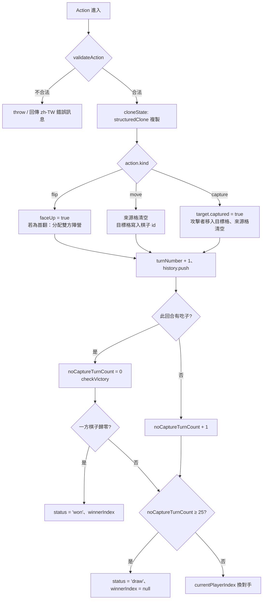
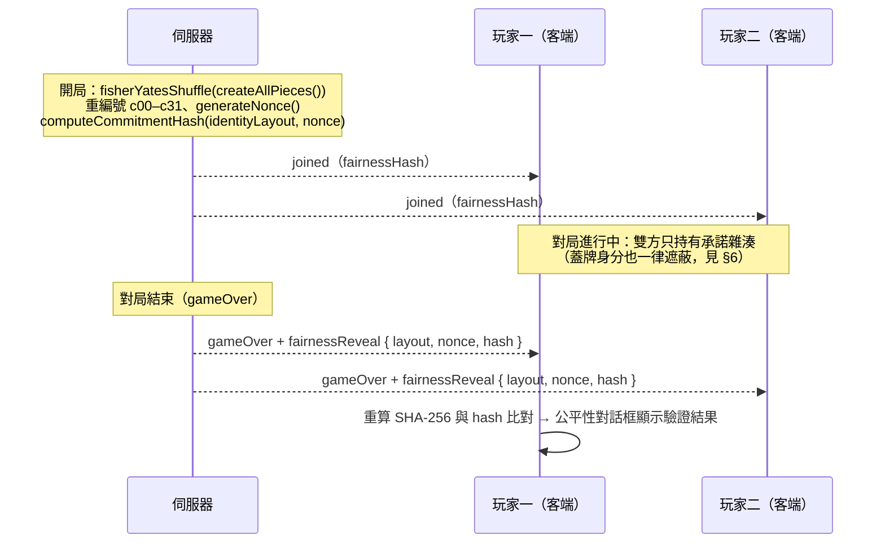

# 08 · 遊戲規則、規則引擎與公平性設計

> 台灣暗棋（Banqi / Half-Blind Chess）3D 網頁遊戲 — 軟體開發規格書 遊戲規則章節
> 文件版本：v1.0（對應產品版號 v1.1.33）· 最後更新：2026-08-29
> 規則基準：`RULES_VERSION = 'Taiwan Dark Chess Rules v1'`（`src/game/constants.ts`）
> 本文所有規則、常數與函式名稱均以實際原始碼為準。

---

## 1. 概述

本專案的遊戲規則由**純 TypeScript 規則引擎**（`src/game/`）單一來源（single source of truth）定義，同時被三個情境共用：

| 情境 | 使用方式 |
| --- | --- |
| 雙人同機（Hotseat） | `src/app.ts` 直接呼叫 `createGame()` / `applyAction()` |
| 線上對戰（Server-authoritative） | `server/room.ts` 在伺服器端呼叫同一套引擎，動作一律由伺服器驗證後套用 |
| 單元測試 | `src/tests/`（Vitest）針對引擎直接測試，不經過渲染層 |

規則引擎**零 DOM、零 Three.js、零 Rapier 依賴**——3D 渲染與物理只是表現層，任何物理動畫結果都不會影響棋局狀態。

---

## 2. 台灣暗棋規則完整定義

### 2.1 棋具：32 子組成

由 `src/game/pieces.ts` 的 `createAllPieces()` 依 `PIECE_COUNTS`（`src/game/constants.ts`）生成，紅黑各 16 子，全部以蓋牌（`faceUp: false`）出場：

| 兵種（`PieceType`） | 階級值（`RANK`） | 紅方數量 | 黑方數量 | 紅方字（`PIECE_CHAR.red`） | 黑方字（`PIECE_CHAR.black`） |
| --- | ---: | ---: | ---: | :---: | :---: |
| general（將／帥） | 7 | 1 | 1 | 帥 | 將 |
| advisor（士／仕） | 6 | 2 | 2 | 仕 | 士 |
| elephant（象／相） | 5 | 2 | 2 | 相 | 象 |
| rook（車／俥） | 4 | 2 | 2 | 俥 | 車 |
| horse（馬／傌） | 3 | 2 | 2 | 傌 | 馬 |
| cannon（炮／包） | 2 | 2 | 2 | 炮 | 包 |
| pawn（兵／卒） | 1 | 5 | 5 | 兵 | 卒 |
| **合計** | — | **16** | **16** | | |

單機版棋子 id 為語義化字串 `{color}-{type}-{流水號}`，例如 `red-general-0`、`black-pawn-4`；線上對戰時由伺服器改編為不透明代號 `c00`–`c31`（見 §6）。

### 2.2 階級吃子規則

一般吃子邏輯實作於 `src/game/rules.ts` 的 `rankAllowsCapture()`（由 `canCapture()` 呼叫）：

- **基本原則**：階級值高者可吃階級值低或相等者（`RANK[attacker.type] >= RANK[target.type]`）。
- **兵（卒）特例**：只能吃敵方的兵（卒）與將（帥）。
- **將（帥）特例**：可以吃敵方任何兵種，**唯獨不能吃兵（卒）**。
- **炮特例**：完全不理會階級（見 §2.5）。
- 只能吃**敵方**棋子（`attacker.color === target.color` 判定為非法，錯誤訊息「不能吃自己的棋」）。
- 一般吃子要求攻擊者與目標**相鄰**（`isAdjacent()`：row/col 差的曼哈頓距離恰為 1）。

| 攻擊方 ↓ 可吃目標 → | 帥/將 | 仕/士 | 相/象 | 俥/車 | 傌/馬 | 炮/包 | 兵/卒 |
| --- | :-: | :-: | :-: | :-: | :-: | :-: | :-: |
| 帥／將 | ✅ | ✅ | ✅ | ✅ | ✅ | ✅ | ❌（特例） |
| 仕／士 | ❌ | ✅ | ✅ | ✅ | ✅ | ✅ | ✅ |
| 相／象 | ❌ | ❌ | ✅ | ✅ | ✅ | ✅ | ✅ |
| 俥／車 | ❌ | ❌ | ❌ | ✅ | ✅ | ✅ | ✅ |
| 傌／馬 | ❌ | ❌ | ❌ | ❌ | ✅ | ✅ | ✅ |
| 炮／包 | ✅（隔子） | ✅（隔子） | ✅（隔子） | ✅（隔子） | ✅（隔子） | ✅（隔子） | ✅（隔子） |
| 兵／卒 | ✅（特例） | ❌ | ❌ | ❌ | ❌ | ❌ | ✅ |

> 「炮／包」一列的 ✅ 表示隔一子後可吃任意兵種；未隔子時任何目標都不可吃。
> 兵種間的 ✅/❌ 完全由 `RANK` 大小決定——**只有「將帥不吃兵卒」「兵卒僅吃兵卒與將帥」兩個攻擊方特例**，士/象/車/馬吃兵卒皆依一般階級規則允許（`RANK` 皆大於 1）。

### 2.3 蓋牌機制與翻牌規則

- 開局 32 子全部蓋牌隨機佈滿 4×8 棋盤（`createGame()`，見 §4）。
- 蓋牌棋子（`faceUp: false`）：
  - **身分隱藏**：對雙方與觀眾皆不可見其顏色與兵種。
  - **不可移動**：`canMove()` 要求 `piece.faceUp`；`validateAction` 回「不能移動暗棋」。
  - **不可用來吃子，也不可被吃**：`canCapture()` 同時要求攻擊者與目標 `faceUp`；`validateAction` 分別回「不能使用暗棋吃子」「不能吃暗棋」。蓋牌棋唯一能互動的方式就是翻開它。
  - **可作為炮的「砲架」**：隔子判定 `countPiecesBetween()` 只看格上是否有子，不分明暗、不分敵我（`cannon.test.ts` 明確驗證「蓋牌可當砲架」）。
- 翻牌（flip）動作：
  - 任何蓋牌棋子皆可翻（`validateAction` 對 flip 只檢查「棋子存在且未翻開」），翻開後**位置不變**。
  - 已翻開的棋不可再翻（錯誤訊息「這顆棋已經翻開」）。
  - **首翻定色**：本局第一次翻牌時，翻牌者取得被翻開的顏色陣營，對手取得另一色；此分配在整局固定，之後翻牌不再改變陣營（`applyAction()` flip 分支；`rules.test.ts`「first flip assigns camps」驗證）。
  - 首翻之前雙方 `color` 皆為 `null`，因此移動與吃子動作都會被擋下（「這不是你的棋子」）——**每局第一手必然是翻牌**。

### 2.4 移動規則

實作於 `src/game/rules.ts` 的 `canMove()` 與 `getLegalMoves()`：

- **所有兵種一視同仁**（含炮）：每次移動恰一步，上下左右（正交方向）擇一，`isAdjacent()` 判定。
- **不可斜走**、不可一次走多格、不可跳越（目標格必須為空：`pieceIdAt(state, to) === null`）。
- 不可走出棋盤（`isOnBoard()` / 邊界檢查）。
- 移動不重設和局計數，翻牌與移動皆使 `noCaptureTurnCount` 加一（見 §2.8）。

### 2.5 炮（包）隔子吃

炮是唯一可以長距離吃子的兵種，邏輯在 `canCapture()` 的 cannon 分支與 `countPiecesBetween()`：

1. 炮與目標必須在同一行或同一列（否則 `countPiecesBetween` 回 `-1`）。
2. 兩者之間必須**恰好有一枚棋子**當「砲架」（screen）。
3. 砲架可以是**任何棋子**：敵子、己子、明棋、蓋牌皆可。
4. 砲架數為 0（貼身直線）、2 或 3 皆不可吃。
5. **完全無視階級**：隔子後可吃將（帥）、可吃兵（卒）、可吃同型炮。
6. 吃子成功後炮**移入目標格**（吃子動作的通用處理，見 §3.6）。

`getLegalCaptures()` 對炮做四方向掃描：每個方向找到第一枚棋子當砲架、第二枚棋子才評估是否可吃（且只考慮該枚），因此同一方向上砲架後第二、第三枚不會誤列入合法目標。

### 2.6 回合與行動種類

`Action` 型別（`src/game/types.ts`）定義每回合恰一種行動：

| Action kind | 說明 | 欄位 |
| --- | --- | --- |
| `flip` | 翻開一枚蓋牌 | `pieceId` |
| `move` | 明棋走一步到空格 | `pieceId`、`to: Position` |
| `capture` | 明棋吃掉相鄰（或隔一子）的敵明棋 | `attackerId`、`targetId` |

- **一回合一行動**：`applyAction()` 套用後立即換對手（`opponentIndex()`），沒有連續行動。
- `currentPlayerIndex` 決定誰可行動；移動/吃子時檢查 `piece.color === player.color`，翻牌不受顏色限制。

### 2.7 勝負判定

- 實作於 `src/game/actions.ts` 的 `checkVictory()`：
  - 任一顏色的**未陣亡棋子**（`remainingPieces()`：`!captured`，不分明暗）歸零，該色輸，持有另一色的玩家獲勝。
  - **蓋牌棋仍算存活**——對手還有暗棋在場時，吃光明棋並不結束對局（`victory.test.ts` 驗證）。
  - 勝負**只在有吃子的回合檢查**（`capturedSomething` 條件），翻牌/移動不可能直接終局。
- 結束後 `status = 'won'`、`winnerIndex` 指向勝方，之後任何動作都被 `validateAction` 以「對局已結束」拒絕。
- 線上對戰另有逾時、斷線、認輸等結束原因，屬伺服器層級，對應 `GameOverReason`（見 §6.3）。

### 2.8 和局規則

- **無吃子 25 回合和局**：`NO_CAPTURE_DRAW_LIMIT = 25`（`src/game/constants.ts`）。
  - `noCaptureTurnCount` 記錄「連續未吃子的已完成回合數」：翻牌與移動使其 +1，**任何吃子立即歸零**。
  - `checkDraw()` 判定 `noCaptureTurnCount >= 25` 即 `status = 'draw'`。
  - 若第 25 回合恰好發生吃子，計數歸零、對局繼續（`victory.test.ts`「a capture on the would-be final turn avoids the draw」）。
- **協議和棋**：`agreeDraw()` 直接將狀態標為 `draw`；線上對戰由 `drawOffer`/`drawResponse` WS 訊息協商後由伺服器呼叫。
- 和局時 `winnerIndex = null`。

---

## 3. 規則引擎架構

### 3.1 檔案地圖

| 檔案 | 職責 | 重要匯出 |
| --- | --- | --- |
| `src/game/types.ts` | 全部領域型別 | `Color`、`PieceType`、`Piece`、`Position`、`Player`、`Action`、`HistoryEntry`、`GameState` |
| `src/game/constants.ts` | 規則常數 | `ROWS/COLS/CELL_COUNT`、`NO_CAPTURE_DRAW_LIMIT`、`RANK`、`PIECE_COUNTS`、`PIECE_CHAR`、`COLOR_NAME`、`RULES_VERSION` |
| `src/game/pieces.ts` | 生成 32 子完整棋組 | `createAllPieces()` |
| `src/game/game-state.ts` | 棋盤幾何、查詢、建局、複製 | `positionToIndex()`、`indexToPosition()`、`isOnBoard()`、`pieceIdAt()`、`pieceAt()`、`findPiecePosition()`、`currentPlayer()`、`remainingPieces()`、`capturedPieces()`、`createGame()`、`cloneState()` |
| `src/game/rules.ts` | 移動與吃子的**判定**（不修改狀態） | `isAdjacent()`、`countPiecesBetween()`、`canMove()`、`getLegalMoves()`、`canCapture()`、`getLegalCaptures()` |
| `src/game/actions.ts` | 動作驗證與**套用**（回傳新狀態） | `validateAction()`、`applyAction()`、`switchTurn()`、`checkVictory()`、`checkDraw()`、`agreeDraw()`、`flipPiece()`、`movePiece()`、`capturePiece()` |
| `src/game/shuffle.ts` | 密碼學安全洗牌 | `secureRandomInt()`、`fisherYatesShuffle()`、`shufflePieces()` |
| `src/game/fairness.ts` | commit-and-reveal 公平性 | `generateNonce()`、`serializeLayout()`、`computeCommitmentHash()`、`createCommitment()`、`verifyCommitment()`、`FairnessData` |

### 3.2 設計鐵則：純函式、零 DOM、不可變

1. **純函式、零 DOM 依賴**：`src/game/` 不 import DOM、Three.js、Rapier，Node（伺服器）與瀏覽器（客端）都能直接執行同一份程式碼；僅 Web Crypto（`crypto.getRandomValues` / `crypto.subtle`）為兩端皆有的 Web 標準。
2. **狀態不可變（immutable update）**：`applyAction()` 一律先 `cloneState()`（內部用 `structuredClone`）複製，再對副本修改並回傳**新狀態**；呼叫端持有的舊狀態永遠不被改動。`fisherYatesShuffle()` 同樣不變異輸入陣列（`rules.test.ts` 驗證 shuffle 前後原陣列相等）。
3. **驗證與套用分離**：
   - `validateAction(state, action): string | null` —— 合法回 `null`，不合法回**繁體中文**原因（給 UI 顯示或 WS `invalid` 訊息）。
   - `applyAction(state, action): GameState` —— 內部先呼叫 `validateAction`，不合法直接 `throw`。
   - 伺服器流程：先 `validateAction` 取得錯誤訊息回給客端，通過後才 `applyAction` 產生權威新狀態。
4. **查詢函式不得有副作用**：`canMove` / `canCapture` / `getLegalMoves` / `getLegalCaptures` / `checkVictory` / `checkDraw` 只讀取狀態，供 UI 高亮提示與伺服器預檢共用。

### 3.3 核心資料結構 `GameState`

```ts
interface GameState {
  board: (string | null)[]        // 32 格，index = row * 8 + col，值為棋子 id 或 null
  pieces: Record<string, Piece>   // id → { id, color, type, faceUp, captured }
  players: [Player, Player]       // { id: 'p1'|'p2', name, color: Color | null }
  currentPlayerIndex: 0 | 1
  status: 'playing' | 'won' | 'draw'
  winnerIndex: 0 | 1 | null
  turnNumber: number              // 開局以來已完成的行動數
  noCaptureTurnCount: number      // 連續未吃子回合數（吃子歸零）
  history: HistoryEntry[]         // 公開資訊，逐條記錄已發生的行動
}
```

`createGame(options)`（`src/game/game-state.ts`）接受 `playerNames`、`firstPlayerIndex`（預設 0）、`layout`（測試與續局用的固定佈局；預設 `fisherYatesShuffle(createAllPieces())`），並校驗棋子數必為 32、id 不重複。

### 3.4 動作套用流程

`applyAction()` 的完整流程如下（`src/game/actions.ts`）：



### 3.5 歷史紀錄結構

`HistoryEntry`（`src/game/types.ts`）逐行動記錄，**只含公開資訊**（行動當下已揭曉的棋子），故可直接下發給客端與觀眾：

| 欄位 | 說明 |
| --- | --- |
| `turn` | 行動序號（1 起算，寫入時為 `turnNumber + 1`） |
| `playerIndex` | 0 或 1，行動方座位 |
| `kind` | `'flip' \| 'move' \| 'capture'` |
| `pieceColor` / `pieceType` | 行動棋子的顏色與兵種（翻牌即揭曉） |
| `from` / `to` | 移動與吃子的起訖格；flip 僅記 `to`（棋子位置） |
| `targetColor` / `targetType` | 僅 capture：被吃棋子的顏色與兵種 |

客端以 `src/ui/history.ts` 將其轉為人類可讀棋譜：`positionLabel()` 把座標編成 `A1`–`H4`（col → 字母、row+1 → 數字），`formatHistoryEntry()` 產生如「玩家一 翻開 紅帥 A1」「玩家二 將 B1 → A1」「玩家一 兵 A2 ✕ 將 A1」的條目，`formatHistoryConclusion()` 附加勝負結語。

---

## 4. 棋盤表示

### 4.1 4×8 棋盤與索引

- 棋盤為 **4 列（row）× 8 行（col）= 32 格**（`ROWS = 4`、`COLS = 8`、`CELL_COUNT = 32`），一格一子、無空位。
- 線性索引：`positionToIndex({row, col}) = row * 8 + col`；反算用 `indexToPosition()`。
- 邊界與整數檢查集中在 `isOnBoard()`；所有查詢皆先過此關。

### 4.2 pieces id 對照

| 情境 | id 形式 | 例子 | 來源 |
| --- | --- | --- | --- |
| 單機（Hotseat） | 語義化 `{color}-{type}-{n}` | `red-general-0`、`black-pawn-4` | `createAllPieces()` |
| 線上對戰 | 不透明 `c00`–`c31` | `c07` | `server/room.ts` `Room.newGame()` 依洗牌序重編號 |

線上對戰中 `c00`–`c31` 的編號順序即洗牌後的 board-index 順序——**id 本身不洩漏任何身分資訊**，這是遮蔽設計的一半；另一半由 `redactState` 完成（§6）。

### 4.3 faceUp / captured 旗標

`Piece` 只靠兩個布林旗標描述生命週期：

| faceUp | captured | 意義 | 對外可見 |
| :-: | :-: | --- | --- |
| false | false | 蓋牌在場上 | 僅 id 與旗標（遮蔽後） |
| true | false | 明棋在場上 | id、color、type |
| — | true | 已陣亡（移出棋盤） | color、type（戰利品資訊） |

---

## 5. 公平性設計

公平性目標：**洗牌不可預測、不可偏袒，且對局雙方能事後驗證開局佈局從未被竄改。**

### 5.1 密碼學安全洗牌（`src/game/shuffle.ts`）

- `secureRandomInt(maxExclusive)`：
  - 來源為 `crypto.getRandomValues(new Uint32Array(1))`，即 32-bit 密碼學亂數。
  - **拒絕取樣（rejection sampling）消除 modulo bias**：`limit = 2^32 - (2^32 % maxExclusive)`，抽到 `value >= limit` 就重抽，因此 `value % maxExclusive` 在 `[0, maxExclusive)` 上**完全均勻**。
  - 邊界防護：不接受非整數、`<= 0` 或 `> 2^32` 的 bound；`maxExclusive === 1` 直接回 0。
- `fisherYatesShuffle(items)`：標準 Fisher–Yates 自尾端往前，第 i 輪以 `secureRandomInt(i + 1)` 選交換位置，**回傳新陣列、不變異輸入**；`shufflePieces()` 為同名包裝。
- 對照測試：`rules.test.ts` 驗證「洗牌保留棋子多重集、不改變輸入」與「`secureRandomInt` 輸出落在邊界內」。

### 5.2 Commit-and-reveal（`src/game/fairness.ts`）

| 元素 | 內容 |
| --- | --- |
| 承諾內容 | `payload = "taiwan-dark-chess-v1\|{layout.join(',')} \|{nonce}"`，`layout` 為 board-index 順序的身分字串序列 |
| 雜湊 | `computeCommitmentHash()`：`crypto.subtle.digest('SHA-256', …)`，輸出 64 位十六進位字串 |
| nonce | `generateNonce()`：16 位元組 `crypto.getRandomValues` → 32 位 hex，一次性 |
| 承諾 | `createCommitment(layout)` 回傳 `FairnessData { layout, nonce, commitmentHash }` |
| 驗證 | `verifyCommitment(data)`：以揭示的 layout + nonce 重算雜湊，與 `commitmentHash` 比對 |

運作時序：



- **對局中只公開雜湊**：`joined` / `rematchStart` 訊息帶 `fairnessHash`；layout 與 nonce 留到對局結束。
- **對局結束後揭示**：`gameOver` 訊息附 `fairnessReveal: FairnessReveal { layout, nonce, hash }`（`src/shared/protocol.ts`），任何人可重算驗證「蓋牌從未在途中被重排」。
- **客端 UI**：`src/ui/dialogs.ts` 的 `showFairnessDialog()` 在對局中僅顯示雜湊（`fairness-playing` 區塊），結束後才展示 layout 棋盤與 nonce，並提供「驗證」按鈕呼叫 `verifyCommitment()` 顯示通過/失敗。
- **單機版同樣受保護**：`src/app.ts` 開局即 `await createCommitment(layout)`，並經 `src/persistence/storage.ts` 的 `saveGame(state, fairness, …)` 存入 localStorage，續局後仍可驗證。

### 5.3 開局先手與再來一局

- **首局先手**：`server/room.ts` `Room.create()` 以 `secureRandomInt(2) as 0 | 1`（同一套拒絕取樣亂數）隨機決定先手座位，傳入 `createGame({ firstPlayerIndex })`。
- **再來一局交換先手**：`Room.startRematch()` 取上一局 `history[0].playerIndex` 為前局先手，`nextFirst = opponentIndex(previousFirst)` 交換後重新 `newGame()`（重新洗牌、重新承諾），避免先手優勢累積。
- 伺服器測試 `server/tests/room.test.ts` 驗證：`joined.fairnessHash` 為 64 位 hex；對局結束後 `fairnessReveal.layout` 長度 32 且 `computeCommitmentHash(layout, nonce) === hash`。

---

## 6. 伺服器遮蔽原則

**鐵則：蓋牌棋子的身分（color/type）絕不離開伺服器。** 一切下行狀態必須先經 `server/redact.ts` 的 `redactState()`。

### 6.1 `redactState(state): RedactedStateDTO`

| 棋子狀態 | 下發內容 |
| --- | --- |
| 蓋牌且未陣亡 | `{ id, faceUp: false, captured: false }` — **無 `color`、無 `type`** |
| 明棋（faceUp） | 完整 `{ id, faceUp: true, captured, color, type }` |
| 已陣亡（captured） | 完整欄位（身分本就公開） |

其餘欄位（board、players、currentPlayerIndex、status、turnNumber、noCaptureTurnCount、history）皆為公開資訊，原樣（深拷貝）下發。對應型別 `RedactedPiece` / `RedactedStateDTO` 定義於 `src/shared/protocol.ts`。

### 6.2 一致的資訊面

- **玩家與觀眾看到完全相同的資訊**：`redactState` 是唯一出口，座位玩家不會比觀眾多看到任何蓋牌身分。
- **翻牌揭示走專用訊息**：動作套用後，`actionApplied` 附帶 `reveal?: PieceReveal { pieceId, color, type }`，只揭曉「這一次」被翻開的那顆棋——不會順手洩漏其他蓋牌。
- **新增下行訊息的檢查點**：任何新訊息若含棋子資料，必須確認來源經 `redactState`（或只含已揭曉棋子），不得直接序列化 `GameState`。

### 6.3 結束原因型別

`GameOverReason`（`src/shared/protocol.ts`）列舉線上對戰七種結束原因，並附 zh-TW 說明表 `GAME_OVER_REASON_TEXT`：

| GameOverReason | 說明 |
| --- | --- |
| `capture` | 吃光對方所有棋子（規則引擎 `checkVictory` 判定） |
| `draw` | 連續 25 步無吃子，判定和棋（`checkDraw`） |
| `draw-agreed` | 雙方同意和棋（`agreeDraw` / WS drawOffer 協商） |
| `timeout` | 走棋逾時，判定敗北（deadline 惰性判定，伺服器層） |
| `forfeit` | 斷線逾時未回，判定敗北（伺服器層） |
| `resign` | 認輸（伺服器層） |
| `aborted` | 對戰提前結束，不計勝負（伺服器層） |

> 前三種由規則引擎直接產生；後四種是線上對戰的伺服器級裁定，規則引擎本身不涉及計時（計時以 deadline 時間戳在 `evaluate()` 惰性判定，setTimeout 僅為輔助）。

---

## 7. 測試策略

規則引擎以 Vitest 做單元測試（`npm test`；`src/tests/` 共 7 個測試檔 + 1 個共用工具，其中 4 檔直接對準規則引擎）：

| 測試檔 | 涵蓋範圍 |
| --- | --- |
| `src/tests/rules.test.ts` | 32 子組成與全蓋牌、棋盤滿格、洗牌保持多重集且不變異輸入、`secureRandomInt` 邊界、**首翻定色與不可重指派**、每回合換手與「一回合一行動」、對局結束後拒絕動作、移動規則（一步正交、禁斜走/長走/越子/出界、暗棋不可動）、一般階級吃子（高吃低、同級互吃、低不可吃高、需相鄰、禁吃己子）、**將帥與兵卒互剋**（兵可吃將、將不可吃兵）、暗棋不可被吃/不可重翻、盤面簿記（move/capture 後 board 與 captured 的更新） |
| `src/tests/cannon.test.ts` | **炮隔子吃全矩陣**：0/1/2/3 個砲架的允否、蓋牌可當砲架、敵子/己子皆可當砲架、縱向與長距離、完全無視階級（可吃將、可吃兵）、有砲架仍禁吃暗棋、禁吃己子與非同線目標、`getLegalCaptures` 每方向只取砲架後第一枚、炮的一般移動與一般棋完全相同（一步、禁滑行、禁跳） |
| `src/tests/victory.test.ts` | 吃光最後一子獲勝、**對手尚有蓋牌則不結束**、玩家二獲勝、`noCaptureTurnCount` 於翻/移 +1 與吃子歸零、達 25 回合判和、第 25 回合吃子免和、`agreeDraw` 協議和棋、**fairness 承諾**：`createCommitment` 產出 64 位 hash、`verifyCommitment` 通過、竄改 layout 後雜湊不同 |
| `src/tests/history.test.ts` | 棋譜呈現層：`positionLabel`（A1–H4）、翻/移/吃三種 `formatHistoryEntry` 格式、`formatHistoryConclusion` 勝負與和局文案 |
| `src/tests/test-utils.ts` | 共用工具：`buildState(specs)` 由 `PieceSpec` 建最小合法 `GameState`（可指定 `currentColor`、`colorsUnassigned`）、`at(row, col)` 座標助手 |

另有 `canned.test.ts`、`members.test.ts`、`fun-names.test.ts` 測罐頭訊息、筆畫排序、趣味暱稱等共用模組，不屬於規則引擎範圍（見 09 章）。線上對戰的公平性與遮蔽則由 `server/tests/room.test.ts` 以實際 WS 流程驗證（fairnessHash 格式、gameOver 時重算承諾雜湊一致）。

---

## 8. 設計取捨與備註

1. **`structuredClone` 換取不可變保證**：32 子棋局狀態極小，每次行動深拷貝的成本可忽略，換得「舊狀態永不變異」的簡單心智模型（利於 undo/歷史導覽與測試斷言）。
2. **`validateAction` 的錯誤訊息即 UX**：zh-TW 原因字串同時供同機 UI 與線上 `invalid` WS 訊息使用，單一訊息來源。
3. **和局計數以「回合」為單位**：`noCaptureTurnCount` 計的是雙方合計的已完成行動數，25 回合即 25 次行動，非 25 輪（每人）。
4. **公平性驗證覆蓋的是「佈局完整性」**：承諾對象是開局 layout 與 nonce；對局過程中的每一步仍依賴 server-authoritative 驗證（客端無法提交非法動作），兩者合起來構成完整防作弊面。
5. **蓋牌可作砲架是刻意的台灣規則**：`countPiecesBetween` 不分明暗計數，測試以「face-down general 當砲架」案例鎖定此行為，避免未來被誤改。