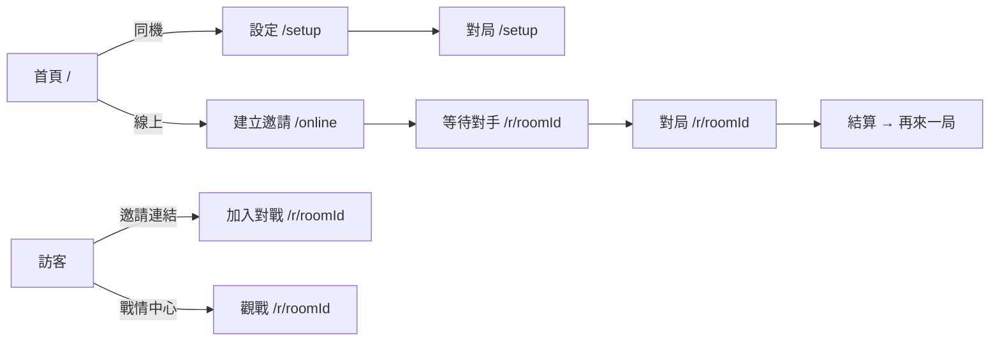

# 台灣暗棋 · 網頁遊戲軟體開發規格書

> 台灣暗棋（Taiwan Dark Chess / Banqi）3D 網頁遊戲的完整軟體開發規格。
> 產品版號 v1.1.33 · 文件產生日期：2026-08-29
> 本規格書由原始碼逐檔分析與開發紀錄（AGENTS.md、README、session log）整理而成。

## 章節索引

| 章節 | 檔案 | 涵蓋內容 | 主要讀者 |
| --- | --- | --- | --- |
| 01 | [01-overview.md](./01-overview.md) | 專案定位、目標、名詞定義、功能總覽、開發脈絡 | 所有人 |
| 02 | [02-architecture.md](./02-architecture.md) | 系統架構設計、模組邊界、資料流、畫面狀態機 | 全體工程 |
| 03 | [03-tech-stack.md](./03-tech-stack.md) | 技術採用：TypeScript/Vite/Three.js/Rapier/Express/ws/Firestore、選型理由 | 全體工程 |
| 04 | [04-platform.md](./04-platform.md) | 平臺選擇：網頁平臺、瀏覽器能力、Cloud Run / GitHub Pages 雙軌、環境變數 | 運維／決策者 |
| 05 | [05-frontend.md](./05-frontend.md) | 前台規劃：使用者流程、畫面規格、RWD、視覺、音效、持久化 | 產品／前端 |
| 06 | [06-backend.md](./06-backend.md) | 伺服器架構、WS 協定、房間生命週期、殘局接手、戰情中心 | 後端 |
| 07 | [07-admin.md](./07-admin.md) | 管理後台：Google 登入、公告、指標報表、IP 監控與封鎖 | 後端／營運 |
| 08 | [08-game-rules.md](./08-game-rules.md) | 遊戲規則、規則引擎、公平性（commit-and-reveal） | 全體工程／企劃 |
| 09 | [09-testing-deployment.md](./09-testing-deployment.md) | 測試策略、建置、Docker、CI/CD、版號、運維 | 測試／運維 |

## 快速導覽

## 核心設計原則（全文適用）

1. **規則與表現分離**：規則引擎（`src/game/`）為純函式、零 DOM 依賴；3D 渲染與物理只是表現層。
2. **Server-authoritative**：線上對戰的一切狀態由伺服器裁定；動作先驗證後套用。
3. **資訊遮蔽**：蓋牌棋子身分絕不離開伺服器（`redactState` 統一遮蔽）。
4. **計時以 deadline 時間戳惰性判定**：`setTimeout` 僅為輔助（Cloud Run CPU throttling 下不可靠）。
5. **每次部署必遞增版號**：唯一來源為 `package.json` 的 `version`。